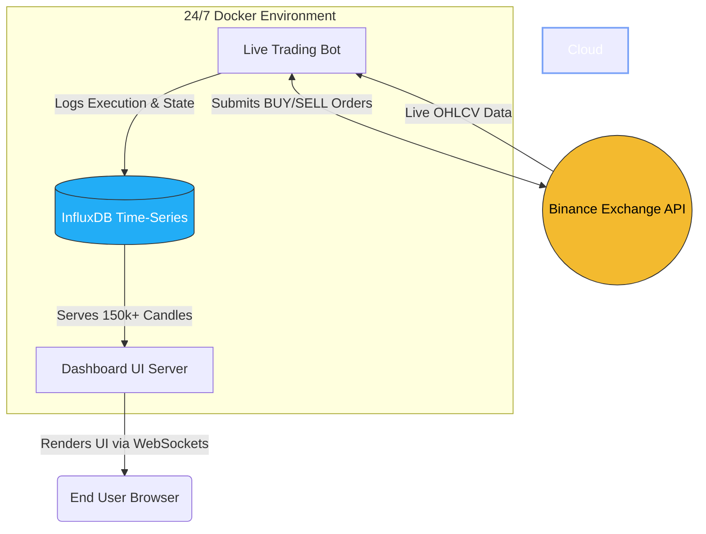
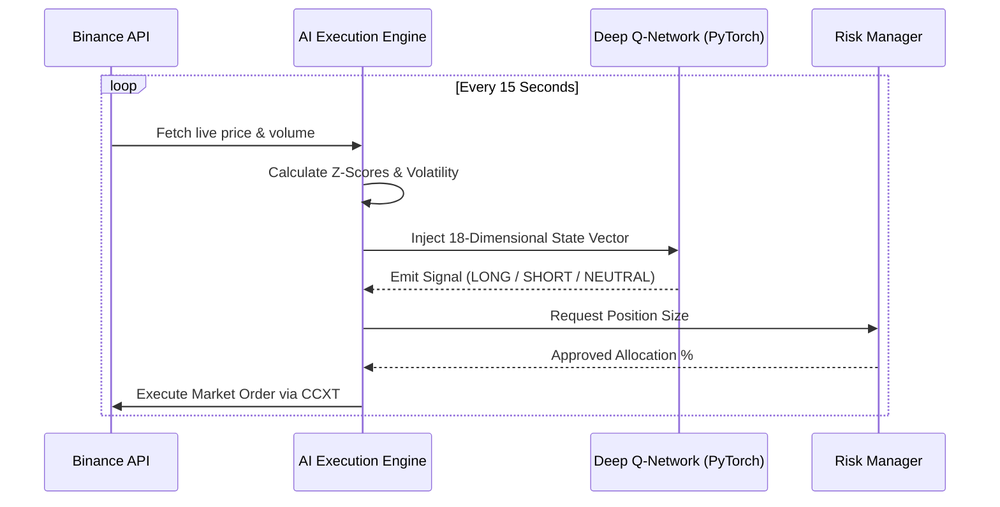

# 🌌 Universal AI Quantitative Terminal


An institutional-grade, multi-asset algorithmic trading engine powered by an **18-Dimensional Deep Q-Network (DQN)**. Designed to operate as a fully autonomous quantitative hedge fund, this system ingests live market data, evaluates mathematical risk, executes bi-directional trades on Binance, and tracks portfolio performance through a premium glassmorphism web dashboard.

---

## 🏛️ System Architecture

The ecosystem runs in an isolated Docker environment, connected via high-speed internal networks. 



---

## 🧠 The AI Trading Loop

Unlike traditional bots that rely on hardcoded indicators (RSI, MACD), this engine utilizes a Deep Reinforcement Learning Agent (`agents/meta_agent.py`) trained on 8 years of historical data.



---

## 🚀 Quick Start (Cloud Deployment)

The system is fully Dockerized and ready to run 24/7 on any cloud VPS (e.g., AWS, DigitalOcean, Oracle Cloud).

### 1. Configure Environment
Create a `.env` file in the root directory and add your Binance Testnet keys:
```env
BINANCE_API_KEY=your_testnet_api_key_here
BINANCE_SECRET_KEY=your_testnet_secret_key_here
```

### 2. Launch the Ecosystem
Upload your code to your cloud server, navigate to the folder, and run:
```bash
docker-compose up -d --build
```
*Docker will automatically build the PyTorch environment, spin up the InfluxDB database, initialize the Dashboard on Port 8000, and ignite the Autonomous Bot.*

### 3. Monitor
- **View Bot Logs:** `docker logs -f financial-ai-bot`
- **View Dashboard:** Navigate to `http://<YOUR_SERVER_IP>:8000`

---

## 📂 Project Structure

```text
ai_crypto_bot/
│
├── agents/                 # AI Logic and Risk Management
│   ├── meta_agent.py       # Deep Q-Network Brain
│   └── risk_agent.py       # Position sizing and capital allocation
│
├── dashboard/              # Flask Web Server
│   ├── app.py              # Backend API pulling from InfluxDB
│   └── templates/
│       └── index.html      # Premium TradingView UI
│
├── scripts/                # Utility and Execution Scripts
│   ├── live_trader.py      # The 24/7 master execution loop connecting CCXT
│   └── convert_csv_to_lp.py# Zero-RAM InfluxDB migration tool
│
├── docker-compose.yml      # Orchestrates App, Bot, Redis, Chroma, Influx
└── Dockerfile              # PyTorch OS configuration
```

---

## ⚠️ Disclaimer
*This software is for educational and research purposes only. Do not risk money which you are afraid to lose. USE THE SOFTWARE AT YOUR OWN RISK. THE AUTHORS AND ALL AFFILIATES ASSUME NO RESPONSIBILITY FOR YOUR TRADING RESULTS.*
