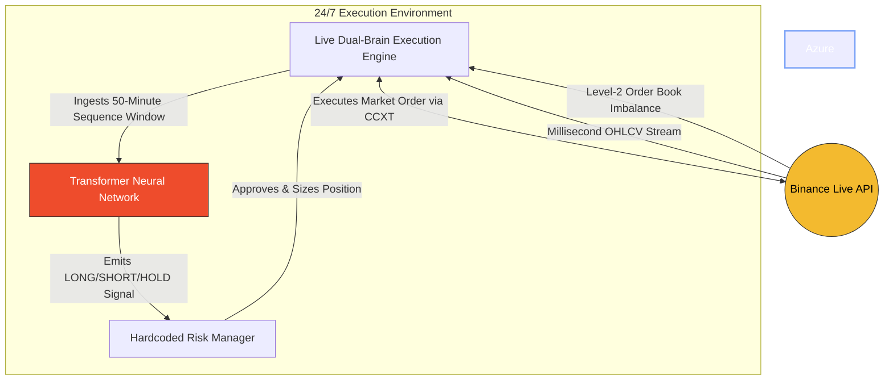

# 🌌 Universal AI Quantitative Terminal


## 📖 What is this Project?

This project is an **Autonomous Institutional-Grade Quantitative Trading Engine**. It was built to replicate the high-frequency algorithmic trading strategies used by billion-dollar hedge funds, specifically tailored for cryptocurrency markets (Binance).

Instead of relying on basic retail trading bots that use simple hardcoded indicators (like "buy when RSI crosses 30"), this system uses a **Time-Series Transformer Neural Network**. It evaluates 8 years of historical market data across 5 major assets simultaneously, finding hidden mathematical correlations and complex price action patterns that human traders cannot see.

Once deployed on a cloud server, the bot runs 24/7 without any human intervention. It constantly streams live data, monitors risk, sizes its own positions, and executes trades autonomously.

---

## ⚙️ How it Works

The system operates using a **Dual-Brain Architecture** that splits trading into two timeframes:
1. **The Intraday Scalper (5-Minute):** Looks for micro-trends and volume imbalances in the Level-2 Order Book. It gets in and out of trades quickly to scalp 1% profits while using tight 0.5% stop-losses.
2. **The Swing Trader (15-Minute):** Looks for larger macroeconomic trends and momentum shifts. It holds trades for days at a time to capture larger 2-3% moves.

### The Lifecycle of a Trade:
1. **Live Ingestion:** Every second, the execution engine (`live_trader.py`) connects to Binance via WebSockets and streams the live price, volume, and **Level-2 Order Book** depth (limit orders placed by whales).
2. **Quantitative Engineering:** The raw price data is instantly converted into a complex 19-Dimensional "State Vector" containing Z-Scores, Volatility Metrics, and Order Book Imbalances.
3. **Transformer Attention:** The AI looks at the last 10 periods (a 50-minute rolling window) and uses "Self-Attention" to mathematically calculate the probability of the price moving up or down.
4. **Execution & Risk Management:** The AI emits a signal (LONG or SHORT). Before executing, a hardcoded **Risk Manager** intercepts the signal, calculates the exact position size based on current portfolio balance, and enforces strict Stop-Loss limits to protect the capital from market crashes.

---

## 🏛️ System Architecture

The ecosystem is designed for deployment on high-speed cloud infrastructure (e.g., Azure) to execute sub-second trades.


```mermaid
graph TD
    subgraph Azure Cloud Server [24/7 Execution Environment]
        B[Live Dual-Brain Execution Engine] 
        T[Transformer Neural Network]
        R[Hardcoded Risk Manager]
    end

    A((Binance Live API)) -->|Millisecond OHLCV Stream| B
    A -->|Level-2 Order Book Imbalance| B
    B -->|Ingests 50-Minute Sequence Window| T
    T -->|Emits LONG/SHORT/HOLD Signal| R
    R -->|Approves & Sizes Position| B
    B <-->|Executes Market Order via CCXT| A
    
    style Azure Cloud Server fill:#1a1b26,stroke:#7aa2f7,stroke-width:2px,color:#fff
    style A fill:#F3BA2F,stroke:#333,color:#000
    style T fill:#EE4C2C,stroke:#333,color:#fff
```

---

## 🚀 Quick Start (Azure Cloud Deployment)

This bot is designed to be hosted 24/7 on a cloud server to maintain zero-latency WebSocket connections with Binance.

### 1. Configure the Environment
Clone the repository onto your Ubuntu server and create a virtual sandbox:
```bash
sudo apt update && sudo apt install python3-venv python3-pip -y
python3 -m venv venv
source venv/bin/activate
pip3 install -r requirements.txt
```

### 2. Download the 8-Year Institutional Dataset
To train the Transformer, you must first fetch the massive 3.5GB Binance historical archives. Run the multi-threaded Bulk Downloader:
```bash
nohup python3 backtesting/download_binance_zips.py --symbol "BTCUSDT,ETHUSDT,BNBUSDT,SOLUSDT,XRPUSDT" --timeframe all --start 2019-01 --end 2026-08 > bulk.log 2>&1 &
```
*Wait for this to finish, then run the live CCXT Sync to patch any missing days up to the exact current minute:*
```bash
python3 scripts/sync_market_data.py
```

### 3. Train the Transformer Brain
Launch the PyTorch training sequence. The AI will walk-forward through 8 years of historical data to optimize its neural weights.
```bash
nohup python3 -u training/train_transformer.py > training.log 2>&1 &
```
*Monitor progress with: `tail -f training.log`*

### 4. Ignite the Live Execution Engine
Once training is complete, start the autonomous Live Trader:
```bash
nohup python3 scripts/live_trader.py > live_trading.log 2>&1 &
```

---

## 📂 Project Structure

```text
ai_crypto_bot/
│
├── agents/                 # Deep Learning Architecture
│   ├── transformer_agent.py# Core Time-Series Transformer & Positional Encoding
│   └── meta_agent.py       # Legacy DQN Architecture (Archived)
│
├── training/               # AI Education
│   └── train_transformer.py# Walk-forward optimization and dataset engineering
│
├── scripts/                # Utility and Execution Scripts
│   ├── live_trader.py      # The 24/7 master execution engine connecting to Binance
│   └── sync_market_data.py # CCXT live-patching for CSV datasets
│
├── backtesting/            # Data Procurement
│   └── download_binance_zips.py # Multi-threaded bulk scraper for Vision Zip files
│
└── data/                   # 3.5GB+ of OHLCV tick data (Ignored in Git)
```

---

## ⚠️ Disclaimer
*This software is for educational and research purposes only. Do not risk money which you are afraid to lose. USE THE SOFTWARE AT YOUR OWN RISK. THE AUTHORS AND ALL AFFILIATES ASSUME NO RESPONSIBILITY FOR YOUR TRADING RESULTS.*
