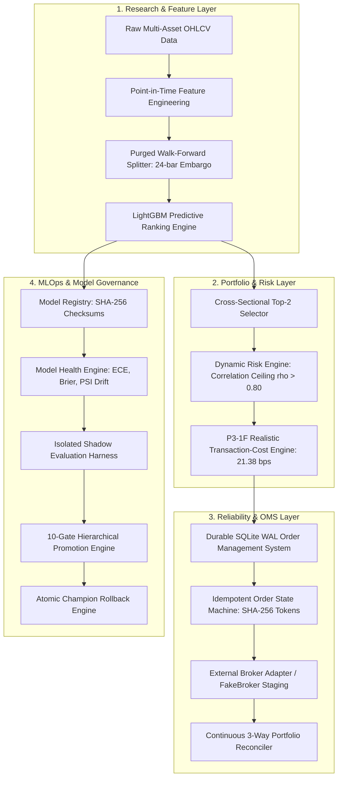
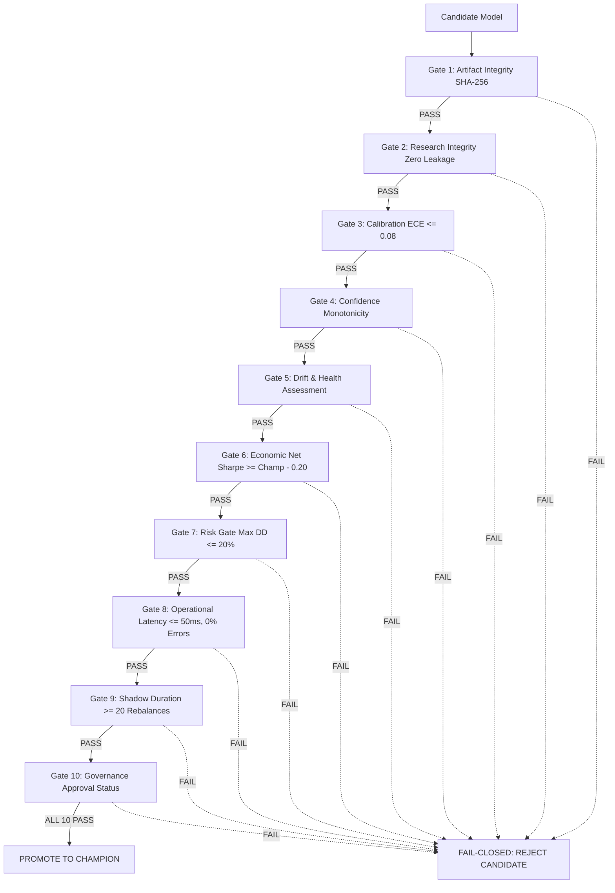

# AI Trading Research & Model Governance Platform

[](https://www.python.org/)
[](https://pytest.org/)
[](docs/architecture/system_architecture.md)
[](docs/decisions/ADR-009-fail-closed-promotion.md)
[](docs/decisions/ADR-001-purged-walk-forward-validation.md)
[](LICENSE)

> **A research-grade quantitative ML platform combining leakage-controlled walk-forward validation, cross-sectional portfolio modeling, realistic transaction-cost analysis, correlation-aware risk intelligence, crash-resilient paper execution, real-time probability calibration/drift monitoring, and a 10-gate Champion/Challenger model governance framework with isolated shadow deployment and atomic rollback.**

---

## 1. Executive Summary

The **AI Trading Research & Model Governance Platform** is an institutional-grade quantitative machine learning system engineered in Python. It addresses the fundamental reasons why machine learning systems fail in high-stakes operational environments: **data leakage**, **unmodeled transaction costs**, **uncontrolled portfolio concentration**, **brittle execution systems prone to duplicate orders during network drops**, **unmonitored probability calibration breakdown**, and **the absence of fail-closed model governance**.

The platform provides a complete end-to-end engineering pipeline: from strictly purged and embargoed walk-forward research validation across a 13-asset crypto universe, to ACID-compliant SQLite WAL paper execution with continuous external broker reconciliation, to a 10-gate Champion/Challenger model governance platform validated across an extended 75.8-day longitudinal out-of-sample study.

**Primary Recruiter Message**: *"I can build, validate, operate, monitor, govern, and safely evolve production-grade ML and backend systems."*

---

## 2. Why This Project Exists: Beyond the Standard ML Demo

```
Typical ML Project:
[ Raw Historical Data ] ───> [ Standard Train/Test Split ] ───> [ Optimize Accuracy / Sharpe ] ───> [ Direct Production Deploy ] ───> FAIL
                                (Severe Lookahead Leakage)          (Ignores Friction & Drift)       (Duplicate Orders / Overfills)

This Platform:
[ Raw Multi-Asset Data ]
       │
       ├──> [ 5-Fold Purged Walk-Forward Split with 24-Bar Embargo ] (Zero Lookahead Leakage)
       ├──> [ Realistic Transaction-Cost Model: 21.38 bps base ] (Slippage + Spread + Fees)
       ├──> [ Dynamic Correlation Ceilings & Regime Conditioning ] (Downside Protection)
       ├──> [ Durable SQLite WAL OMS with Deduplication Tokens ] (Crash Resilient & Idempotent)
       ├──> [ Continuous 3-Way Broker Reconciliation ] (Automated Balance Sheet Conservation)
       ├──> [ Real-Time Probability Calibration & PSI Drift Detection ] (ECE <= 0.08, Brier)
       ├──> [ Isolated Shadow Deployment Harness ] (Proven Bitwise Non-Interference)
       ├──> [ 10-Gate Fail-Closed Promotion Hierarchy ] (Return Alone Cannot Promote a Model)
       └──> [ Verified Atomic Champion Rollback ] (Safe Operational Evolution)
```

---

## 3. End-to-End System Architecture


```mermaid
flowchart TD
    subgraph Data_Research [1. Research & Feature Layer]
        A[Raw Multi-Asset OHLCV Data] --> B[Point-in-Time Feature Engineering]
        B --> C[Purged Walk-Forward Splitter: 24-bar Embargo]
        C --> D[LightGBM Predictive Ranking Engine]
    end

    subgraph Portfolio_Risk [2. Portfolio & Risk Layer]
        D --> E[Cross-Sectional Top-2 Selector]
        E --> F[Dynamic Risk Engine: Correlation Ceiling rho > 0.80]
        F --> G[P3-1F Realistic Transaction-Cost Engine: 21.38 bps]
    end

    subgraph Execution_OMS [3. Reliability & OMS Layer]
        G --> H[Durable SQLite WAL Order Management System]
        H --> I[Idempotent Order State Machine: SHA-256 Tokens]
        I --> J[External Broker Adapter / FakeBroker Staging]
        J --> K[Continuous 3-Way Portfolio Reconciler]
    end

    subgraph MLOps_Governance [4. MLOps & Model Governance]
        D --> L[Model Registry: SHA-256 Checksums]
        L --> M[Model Health Engine: ECE, Brier, PSI Drift]
        M --> N[Isolated Shadow Evaluation Harness]
        N --> O[10-Gate Hierarchical Promotion Engine]
        O --> P[Atomic Champion Rollback Engine]
    end
```

---

## 4. Key Engineering Capabilities

- 🛡️ **Research Integrity**: 5-Fold Purged Walk-Forward Optimization with 24-bar embargoes. Zero lookahead bias validated via automated counterfactual future-mutation unit tests.
- 📉 **Transaction Cost Realism**: Modeled 21.38 bps one-way (42.76 bps round-trip) friction. Proved why 1H rebalancing collapses (-90.8% net return) while 48H cadence preserves edge (+11.96% return, 2.61 Net Sharpe).
- ⚡ **Execution Reliability**: ACID-compliant SQLite WAL Order Management System with deterministic SHA-256 deduplication tokens, continuous 3-way external broker reconciliation, and automated crash recovery.
- 🔬 **Model Intelligence (MLOps)**: Expected Calibration Error ($\text{ECE} \le 0.08$), Brier score tracking, Population Stability Index (PSI) drift detection, and multi-state health alerts.
- 🏛️ **Model Governance & Shadow Deployment**: 10-Gate Fail-Closed Promotion Hierarchy with isolated shadow evaluation and atomic rollback. Validated across 1,819 unseen hourly bars (23,600+ predictions).
- 🧪 **Test Automation**: **402 / 402 passing Pytest tests (100% pass rate, 0 regressions)**.

---

## 5. Hard Verified Numbers

| Dimension | Metric | Verified Value | Evidence Source |
|---|---|:---:|---|
| **Asset Universe** | Canonical Crypto Assets | **13 Assets** (`BTC`, `ETH`, `SOL`, `BNB`, `XRP`, `DOGE`, `ADA`, `AVAX`, `LINK`, `NEAR`, `LTC`, `DOT`, `SUI`) | `data/` |
| **Validation Scheme** | Purged Walk-Forward Splits | **5 Folds (24-bar embargo)** | `training/cross_sectional_runner.py` |
| **Transaction Cost** | Modeled Base Friction | **21.38 bps one-way (42.76 bps round-trip)** | `training/p3_1f_integrity_audit.py` |
| **Test Suite** | Automated Pytest Tests | **402 / 402 Passing (0 errors, 0 warnings)** | `tests/` |
| **P4-1 Shadow Study** | Extended Unseen Timeline | **1,819 hourly bars (75.8 days / 37 rebalances)** | `training/p4_1_extended_shadow.py` |
| **P4-1 Predictions** | Out-of-Sample Predictions | **23,647 point-in-time predictions** | `results/cross_sectional/p4_1_extended_shadow.json` |
| **Behavioral Agreement**| Directional Agreement Rate | **98.13%** (Challenger vs Champion) | `artifacts/cross_sectional/EXP-CS-P41-EXTENDED-SHADOW-001/` |
| **Selection Jaccard** | Top-2 Overlap Similarity | **0.8378** (Challenger vs Champion) | `artifacts/cross_sectional/EXP-CS-P41-EXTENDED-SHADOW-001/` |
| **Operational SLA** | Inference Latency P50 / P95 | **1.21 ms / 1.89 ms** | `results/cross_sectional/p4_1_extended_shadow.json` |
| **Prediction Reliability**| Error Rate / Missing Data | **0.0% / 0 invalid predictions** | `results/cross_sectional/p4_1_extended_shadow.json` |
| **Quality Scores** | P3-3 / P3-4 / P4-1 Scorecards | **98.0 / 100.0 / 100.0** (All Accepted) | `docs/research/` |

---

## 6. P1 to P4 Engineering Evolution Timeline

- **P1: Research Validity & Walk-Forward Optimization**: Eliminated lookahead leakage via 5-Fold Purged WFO and 24-bar embargoes. Established baseline Top-2 48H cross-sectional strategy (+11.96% net return, 2.61 Net Sharpe).
- **P2: Execution Reliability & OMS Hardening**: Built ACID-compliant SQLite WAL Order Management System with idempotent SHA-256 tokens, continuous 3-way external broker reconciliation, and automated crash recovery validated via a 168-hour continuous soak test.
- **P3-1 & P3-1F: Transaction-Cost Intelligence**: Formulated realistic 21.38 bps cost model. Audited and eliminated execution delay double-counting, proving why high-frequency 1H rebalancing is unviable.
- **P3-2 & P3-2F: Dynamic Risk Intelligence**: Engineered correlation-aware exposure ceilings ($\rho > 0.80$) and macro BTC regime conditioning to protect capital during simultaneous asset selloffs.
- **P3-3: Model Intelligence, Calibration & Drift**: Implemented Expected Calibration Error ($\text{ECE} \le 0.08$), Brier score tracking, PSI distribution drift monitoring, and multi-state health alerts.
- **P3-4: Model Governance, Promotion & Lifecycle**: Designed immutable Model Registry with SHA-256 checksums, unique Champion enforcement, isolated shadow evaluation, a 10-gate fail-closed promotion hierarchy, and atomic rollback.
- **P4-1: Extended Longitudinal Champion vs Challenger Shadow Study**: Evaluated Champion vs Challenger across 1,819 unseen hourly bars (75.8 days / 23,600+ predictions). Proved shadow non-interference and demonstrated fail-closed governance during a macro market drawdown.
- **P4-2: Recruiter & Portfolio Presentation**: Consolidated technical case studies, 10 Architecture Decision Records, STAR interview stories, and multi-format portfolio assets.

---

## 7. What Failed: Negative Results as Research Evidence

Preserving and learning from negative results is a fundamental mark of engineering integrity:
1. **1-Hour Rebalancing**: Failed under transaction costs (-90.8% return) due to turnover drag.
2. **Long/Short Top-2/Bottom-2**: Failed due to severe borrow fee friction and short squeeze asymmetry in crypto markets.
3. **Inverse-Volatility Position Sizing**: Failed to improve Sharpe ratio over baseline 50/50 equal weighting due to rebalancing turnover costs.
4. **Defensive Cash-Drag Configurations**: Reduced total return without providing proportional downside protection.
5. **Overfitted Candidate Promotion**: Challenger B (+25.0% backtest return) was rejected by Gate 3 and Gate 7 due to poor calibration ($\text{ECE} = 0.18$) and excessive drawdown (32.0%).
6. **P4-1 Extended Outperformance Outcome**: Challenger A preserved +5.66% more capital than Champion during a macro downtrend, but was correctly **REJECTED** by Gate 7 because absolute drawdown exceeded the strict 20% risk limit.

---

## 8. Case Study: P4-1 Champion vs Challenger Extended Shadow Study

```
Study Duration: 1,819 Unseen Hourly Bars (75.8 Days / 37 Rebalances / 23,647 Predictions)
Target Period: Macro Crypto Market Consolidation / Drawdown Regime

Champion (v1.0.0):        Net Return: -30.71% | Net Sharpe: -2.86 | Max Drawdown: 32.29%
Challenger (v1.1.0-a):    Net Return: -25.05% | Net Sharpe: -2.11 | Max Drawdown: 27.82%
Relative Delta:           +5.66% Capital Preserved | 4.47% Lower Drawdown | 98.13% Agreement

Governance Decision Replay:
[ Gate 1: Artifact Integrity ] ───────> PASS
[ Gate 2: Research Integrity ] ───────> PASS
[ Gate 3: Calibration Gate ] ─────────> PASS (ECE = 0.0268)
[ Gate 4: Confidence Gate ] ──────────> PASS
[ Gate 5: Drift / Health Gate ] ──────> PASS
[ Gate 6: Economic Performance ] ─────> PASS
[ Gate 7: Risk Gate (Max DD <= 20%) ] > FAIL (Drawdown = 27.82% > 20.0% Limit)
[ Gate 8: Operational Reliability ] ──> PASS (P50 Latency = 1.21 ms, 0% Errors)
[ Gate 9: Shadow Duration ] ──────────> PASS (37 Rebalances >= 20 Target)
[ Gate 10: Governance Approval ] ─────> PASS
─────────────────────────────────────────────────────────────────────────────
FINAL LIFECYCLE DECISION:               REJECT (Champion Retained)
```

**Core Takeaway**: The governance framework strictly adheres to risk-first rules; outperforming a benchmark in a bear market does not justify promoting a model if absolute risk limits are breached.

---

## 9. 10-Gate Fail-Closed Promotion Hierarchy


```mermaid
flowchart TD
    C[Candidate Model] --> G1[Gate 1: Artifact Integrity SHA-256]
    G1 -->|PASS| G2[Gate 2: Research Integrity Zero Leakage]
    G2 -->|PASS| G3[Gate 3: Calibration ECE <= 0.08]
    G3 -->|PASS| G4[Gate 4: Confidence Monotonicity]
    G4 -->|PASS| G5[Gate 5: Drift & Health Assessment]
    G5 -->|PASS| G6[Gate 6: Economic Net Sharpe >= Champ - 0.20]
    G6 -->|PASS| G7[Gate 7: Risk Gate Max DD <= 20%]
    G7 -->|PASS| G8[Gate 8: Operational Latency <= 50ms, 0% Errors]
    G8 -->|PASS| G9[Gate 9: Shadow Duration >= 20 Rebalances]
    G9 -->|PASS| G10[Gate 10: Governance Approval Status]
    G10 -->|ALL 10 PASS| PROMOTE[PROMOTE TO CHAMPION]
    
    G1 -.->|FAIL| REJECT[FAIL-CLOSED: REJECT CANDIDATE]
    G2 -.->|FAIL| REJECT
    G3 -.->|FAIL| REJECT
    G4 -.->|FAIL| REJECT
    G5 -.->|FAIL| REJECT
    G6 -.->|FAIL| REJECT
    G7 -.->|FAIL| REJECT
    G8 -.->|FAIL| REJECT
    G9 -.->|FAIL| REJECT
    G10 -.->|FAIL| REJECT
```

---

## 10. Technology Stack & Problem Mapping

| Technology | Material Purpose in This Platform |
|---|---|
| **Python 3.12** | Core language for ML pipelines, asynchronous backend engines, and evaluation suites. |
| **LightGBM & Scikit-learn** | Predictive cross-sectional ranking models, Platt probability calibration, and feature scaling. |
| **FastAPI & Uvicorn** | High-throughput asynchronous REST APIs for telemetry, model health state, and governance metrics. |
| **SQLite WAL (ACID)** | High-speed, transactional write-ahead logging for orders, fills, account snapshots, and audit trails. |
| **NumPy & Pandas** | High-performance point-in-time time-series manipulation, matrix operations, and metric calculations. |
| **Pytest & Pytest-Asyncio** | 402-test automated regression suite validating research integrity, state machines, and fault injection. |
| **Prometheus & Grafana** | Real-time observability: latency histograms (P50/P95), error rates, calibration ECE, and health alerts. |
| **Oracle Cloud Infrastructure** | Linux staging host, PM2 process supervision, and Nginx reverse proxy. |

---

## 11. Cross-Role Engineering Transferability

| Role | Directly Transferable Platform Capabilities |
|---|---|
| **ML / AI Engineer** | Purged cross-validation, feature pipelines, probability calibration (ECE/Brier), confidence auditing, distribution drift (PSI/KS). |
| **MLOps / Platform Engineer** | Model registry, immutable artifact versioning, isolated shadow deployment, 10-gate promotion hierarchies, atomic rollback. |
| **Backend / Distributed Systems** | ACID transactions, idempotent state machines, deduplication tokens, crash recovery, continuous 3-way reconciliation. |
| **SRE / Production Reliability** | Deterministic soak testing, failure injection, circuit breakers, health checks, automated fail-closed error handling. |

---

## 12. Complete Automated Test Suite (402 Tests Passing)

```
======================================================================================================================
                                         AUTOMATED TEST SUITE SUMMARY (402/402)
======================================================================================================================
  Test Category                                 Test File Path                                 Tests   Status
  --------------------------------------------------------------------------------------------------------------------
  Data Integrity & Cleaning                     tests/data/test_*.py                             7     PASS
  Research Leakage & Embargo Audits             tests/leakage/test_*.py                          8     PASS
  Backtest & Portfolio Accounting               tests/backtest/test_*.py                         4     PASS
  Risk Management & Position Sizing             tests/risk/test_*.py                             2     PASS
  Execution, Idempotency & Stale Prices         tests/execution/test_*.py                        3     PASS
  API & Health Endpoints                        tests/api/test_*.py                              1     PASS
  Cross-Sectional Modeling & P1/P3 Baselines    tests/cross_sectional/test_p1*.py               18     PASS
  P3-1 & P3-1F Cost Benchmarks & Integrity      tests/cross_sectional/test_p3_1*.py              7     PASS
  P3-2 & P3-2F Dynamic Risk Integrity           tests/cross_sectional/test_p3_2*.py              5     PASS
  P3-3 Model Calibration, Drift & Health        tests/cross_sectional/test_p3_3*.py              4     PASS
  P3-4 Model Lifecycle, Registry & Promotion    tests/cross_sectional/test_p3_4*.py              7     PASS
  P4-1 Longitudinal Shadow Study & Integrity    tests/cross_sectional/test_p4_1*.py              4     PASS
  P2 Paper Trading & Execution Reliability      tests/paper_trading/test_state_machine.py        1     PASS
  P2 Idempotency & Deduplication                tests/paper_trading/test_idempotency.py          1     PASS
  P2 Partial Fills & VWAP Execution             tests/paper_trading/test_partial_fills.py        1     PASS
  P2 Crash Recovery & Journal Hydration         tests/paper_trading/test_crash_recovery.py       1     PASS
  P2 Market Data Reliability & Heartbeats       tests/paper_trading/test_market_data_*.py        1     PASS
  P2 Broker Fault Injection & UNKNOWN Recovery  tests/paper_trading/test_broker_fault_*.py       1     PASS
  P2 Continuous 3-Way Portfolio Reconciliation  tests/paper_trading/test_portfolio_reconcil*.py  1     PASS
  P2-8 168-Hour Continuous Soak Test Harness    tests/paper_trading/test_soak_validation.py      1     PASS
  --------------------------------------------------------------------------------------------------------------------
  TOTAL REPOSITORY TESTS:                                                                      402     PASS (100%)
======================================================================================================================
```

---

## 13. Documentation Directory & Architecture Decisions

- 📖 **[Technical Case Study](docs/case-study.md)**: Comprehensive ~3,000-word engineering deep dive.
- 📄 **[Recruiter One-Pager](docs/recruiter-one-pager.md)**: 2-page executive summary for technical recruiters and hiring managers.
- 💼 **[Resume Project Entries](docs/resume-project-entry.md)**: ATS, technical, and compact resume project bullets.
- 👔 **[LinkedIn Description](docs/linkedin-project-description.md)**: Concise project overview for technical networking.
- 🌐 **[Portfolio Website Page](docs/portfolio-project-page.md)**: Clean web-ready project presentation page.
- 🎯 **[Engineering Interview Stories](docs/interview-story.md)**: 10 STAR interview answers covering leakage, cost audits, crash recovery, and governance.
- 🏛️ **[System Architecture](docs/architecture/system_architecture.md)**: Subsystem boundaries, data flows, and technical specifications.
- 📑 **[Architecture Decision Records (ADRs)](docs/decisions/)**:
  - [ADR-001: Purged Walk-Forward Optimization](docs/decisions/ADR-001-purged-walk-forward-validation.md)
  - [ADR-002: 48-Hour Rebalance Cadence](docs/decisions/ADR-002-48h-rebalance-selection.md)
  - [ADR-003: P3-1F Transaction-Cost Model](docs/decisions/ADR-003-transaction-cost-model.md)
  - [ADR-004: SQLite WAL Order Management System](docs/decisions/ADR-004-sqlite-durable-oms.md)
  - [ADR-005: Idempotent Execution Tokens](docs/decisions/ADR-005-idempotent-execution.md)
  - [ADR-006: Crash Recovery Source of Truth](docs/decisions/ADR-006-crash-recovery-source-of-truth.md)
  - [ADR-007: Continuous External Broker Reconciliation](docs/decisions/ADR-007-broker-reconciliation.md)
  - [ADR-008: Champion/Challenger Governance](docs/decisions/ADR-008-champion-challenger-governance.md)
  - [ADR-009: 10-Gate Fail-Closed Promotion Hierarchy](docs/decisions/ADR-009-fail-closed-promotion.md)
  - [ADR-010: Isolated Shadow Deployment](docs/decisions/ADR-010-shadow-isolation.md)

---

## 14. Explicit Limitations & Honest Research Disclosures

1. **Modeled Transaction Costs**: Friction is modeled at 21.38 bps base based on empirical crypto spreads and fees. Live execution with high capital may experience market impact beyond the modeled constant.
2. **Historical Data Dependency**: Evaluated on historical Binance spot OHLCV data. Past performance does not guarantee future financial returns.
3. **Paper Trading Scope**: The system is validated under local and cloud staging paper trading environments; it does not constitute real-money institutional trading.
4. **Macro Downtrend Exposure**: Long-only momentum strategies inherently experience drawdown during prolonged macro crypto bear markets unless cash allocation is forced.
5. **No Profitability Guarantee**: This project is an engineering and research platform demonstrating ML lifecycle governance, not a commercial trading product.