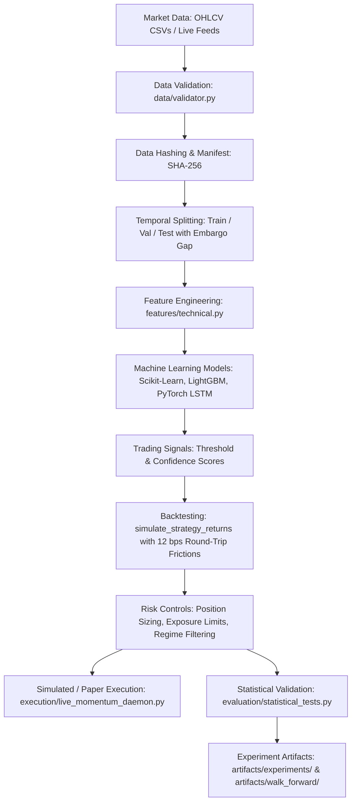

# AI Trading Research Platform

[](https://github.com/ajay1951/ai-trading-research-platform/actions/workflows/ci.yml)
[](http://129.225.85.106)
[](https://www.python.org/downloads/)
[](https://fastapi.tiangolo.com/)
[-brightgreen.svg)](tests/)
[](LICENSE)

> **Research Disclaimer**: This system is intended for research and paper trading. It does not execute real-money trades. Backtest and paper-trading results do not imply future profitability.

> **Research and ML engineering platform for evaluating quantitative cryptocurrency trading strategies under strict anti-leakage controls, realistic execution costs, walk-forward validation, statistical testing, and 24/7 autonomous paper trading using live market data.**

```text
This is not a simple trading bot.

It is a research and ML engineering platform.

It includes:
- data validation
- leakage prevention
- multiple ML models
- realistic transaction costs
- backtesting
- risk controls
- walk-forward testing
- statistical validation
- failure analysis
- reproducible experiments
- automated testing
- CI/CD
- 24/7 autonomous paper trading using live market data
```

---

## 1. Project Overview

### What the Project Is
The **AI Trading Research Platform** is an auditable, end-to-end quantitative research environment built in Python. It provides the disciplined infrastructure required to formulate, train, backtest, statistically validate, and paper-trade machine learning trading strategies without common methodological traps like lookahead bias, unmodeled transaction frictions, or cherry-picked backtest windows.

### What Problem It Solves
Most algorithmic trading projects online suffer from fatal credibility issues:
1. **Pervasive Data Leakage**: Fitting standard scalers across the full dataset, computing rolling indicators over future bars, or misaligning timestamps causes artificially inflated backtest profits that collapse in live markets.
2. **Frictionless Delusions**: Ignoring exchange taker fees (e.g. 0.04%) and market impact slippage (e.g. 0.02%) creates high-frequency churn strategies whose theoretical gains are entirely consumed by fees.
3. **Overfitting & Single-Window Cherry-Picking**: Optimizing a model on one favorable slice (e.g., a massive bull market) and claiming persistent alpha without out-of-sample or walk-forward verification.
4. **Synthetic Statistical Validation**: Generating synthetic Gaussian returns rather than validating actual empirical trade logs.

### Who It Is Designed For
* **Quantitative Researchers & ML Engineers** who require a rigorous test harness with causal point-in-time features, out-of-sample temporal cross-validation, and statistical stress testing.
* **Institutional Interviewers & Recruiters** evaluating production-grade ML engineering, clean system architecture, statistical honesty, and auditable research methodology.

### What I Personally Built
* **Causal Feature Pipeline**: Point-in-time indicator engine ([features/technical.py](features/technical.py), [backtesting/quant_features.py](backtesting/quant_features.py)) ensuring zero forward-looking lookahead.
* **Leakage-Proof Splitting Engine**: Temporal splitters enforcing strict chronological splits and embargo buffers ([data/splitting.py](data/splitting.py)).
* **Multi-Model Benchmark Suite**: Standardized test harness comparing passive index benchmarks, moving averages, classical linear/ensemble models, gradient boosting, and deep neural networks on identical data slices ([training/benchmark_suite.py](training/benchmark_suite.py)).
* **Empirical Statistical Validation Engine**: Stationary block bootstrap Sharpe distributions and Monte Carlo drawdown simulations consuming real trade-level return series ([evaluation/statistical_tests.py](evaluation/statistical_tests.py)).
* **Purged Walk-Forward Engine**: 5-fold expanding cross-validation with embargo buffers and artifact export ([training/walk_forward.py](training/walk_forward.py)).
* **37-Test Verification Hierarchy**: Pytest test suite covering data integrity, timestamp causality, transaction costs, risk constraints, execution idempotency, and API endpoints ([tests/](tests/)).
* **Production API Service & Cloud Paper-Trading Workstation**: FastAPI backend and Next.js quantitative dashboard deployed for continuous 24/7 paper trading with live exchange data feeds ([api/](api/), [execution/live_momentum_daemon.py](execution/live_momentum_daemon.py)).

### Why It Is Different from a Simple Trading Bot
Simple trading bots are scripts that connect to an exchange API and place basic RSI/MACD buy/sell orders. They lack data quality validation, temporal leakage prevention, walk-forward testing, transaction cost modeling, sample-size stability checks, and reproducible experiment artifact tracking. This platform is a **research and verification testbed** designed to evaluate quantitative strategies rigorously before any capital allocation.

---

## 2. Cloud Paper-Trading Deployment

The platform is deployed in a live cloud environment to demonstrate production ML systems engineering, continuous operational monitoring, and automated paper execution:

* **Live Web Workstation**: **[http://129.225.85.106](http://129.225.85.106)** *(or `https://129-225-85-106.sslip.io`)*
* **Oracle Cloud Infrastructure (OCI)**: Hosted on an Ubuntu 24.04 LTS instance with 2GB swap protection, managed under PM2 process supervision and an Nginx reverse proxy.
* **Live Market-Data Ingestion**: Ingests real-time candle and ticker data directly from public exchange feeds (Binance spot/futures via CCXT) on an hourly candle-close trigger.
* **ML Signal Generation**: Evaluates rolling point-in-time technical and momentum features at finalized candle closes to generate directional predictions without lookahead.
* **Risk Controls**: Enforces strict exposure limits, single-asset concentration limits (max 2 active slots), and automatic macro regime filtering (cash preservation in bear regimes).
* **Simulated / Paper Order Execution**: Fills orders purely in simulation against live exchange prices, tracking synthetic fills, slippage, and fees. **The platform does NOT execute real-money orders.**
* **Continuous 24×7 Operation**: Supervised 24/7 by PM2 (`nexus-bot` and `nexus-frontend`) with state persistence (`data/live_state.json`) ensuring resilient recovery across network disruptions or host restarts.

---

## 3. Architecture

The following diagram illustrates the unidirectional data and execution flow through the platform:


```mermaid
flowchart TD
    A[Market Data: OHLCV CSVs / Live Feeds] --> B[Data Validation: data/validator.py]
    B --> C[Data Hashing & Manifest: SHA-256]
    C --> D[Temporal Splitting: Train / Val / Test with Embargo Gap]
    D --> E[Feature Engineering: features/technical.py]
    E --> F[Machine Learning Models: Scikit-Learn, LightGBM, PyTorch LSTM]
    F --> G[Trading Signals: Threshold & Confidence Scores]
    G --> H[Backtesting: simulate_strategy_returns with 12 bps Round-Trip Frictions]
    H --> I[Risk Controls: Position Sizing, Exposure Limits, Regime Filtering]
    I --> J[Simulated / Paper Execution: execution/live_momentum_daemon.py]
    I --> K[Statistical Validation: evaluation/statistical_tests.py]
    K --> L[Experiment Artifacts: artifacts/experiments/ & artifacts/walk_forward/]
```

### Architecture Pipeline Summary
1. **Market Data**: Raw hourly and multi-timeframe cryptocurrency OHLCV data.
2. **Data Validation**: Validates continuity, monotonically increasing timestamps, positive volume, and valid price relationships.
3. **Temporal Splitting**: Chronological partitioning enforcing an embargo buffer between training and testing sets.
4. **Feature Engineering**: Calculates rolling causal features (RSI, MACD, ATR, Bollinger Bands, Volatility) using strictly backward-looking windows.
5. **Machine Learning Models**: Fits models strictly on in-sample data and generates out-of-sample directional probabilities.
6. **Trading Signals**: Applies confidence thresholds and volatility filters to generate entry and exit signals.
7. **Backtesting & Costs**: Simulates next-bar open execution (`t+1_open`) deducting 4 bps fee + 2 bps slippage per fill.
8. **Risk Controls & Paper Execution**: Enforces slot limits, cash preservation, and executes simulated paper trades. **No real-money orders are sent to exchanges.**
9. **Statistical Validation**: Evaluates actual trade returns via block bootstrap and Monte Carlo resampling.
10. **Experiment Artifacts**: Emits standardized, reproducible artifacts with full git commit provenance.

---

## 4. Research Methodology

1. **Point-in-Time Causality**: All features at time $t$ use information available strictly at or before $t$. Forward prices are shifted by negative steps exclusively for target labeling during training.
2. **Strict In-Sample / Out-of-Sample Separation**: No parameters, hyperparameter searches, or feature normalizers are tuned or fit on validation or test periods.
3. **Purged Embargo Buffers**: Following Marcos López de Prado's methodology, an embargo buffer of 24 bars (or 1% of the timeline) separates training and testing windows to eliminate serial correlation leakage from rolling technical indicators.
4. **Standardized Comparison**: All model architectures are evaluated on the exact same out-of-sample timestamps with identical transaction costs and position rules.
5. **Empirical Honesty**: Metrics derived from small sample sizes (< 30 trades) are explicitly flagged as statistically unstable rather than reported as persistent alpha.

---

## 5. Data Validation

Data quality checks are implemented in [data/validator.py](data/validator.py) and verified by 7 dedicated automated tests in [tests/data/](tests/data/):

* **Missing Candle Detection**: Identifies gaps in hourly candles exceeding standard time step tolerance.
* **Monotonic Timestamps**: Verifies that candle timestamps strictly increase chronologically with zero out-of-order rows.
* **Duplicate Detection**: Flags and removes repeated timestamps.
* **Price Relationship Consistency**: Enforces $High \ge \max(Open, Close)$ and $Low \le \min(Open, Close)$.
* **Volume Non-Negativity**: Asserts $Volume \ge 0$.
* **Timezone Standardization**: Normalizes all timestamps to UTC.

```bash
# Validate any dataset file:
python -m data.validator --file data/BTCUSDT_1h_historical.csv --timeframe 1h
```

---

## 6. Leakage Prevention

Data leakage is the primary cause of false quantitative discoveries. The platform enforces anti-leakage controls in code and validates them with 9 regression tests in [tests/leakage/](tests/leakage/):

1. **Chronological Splitting**: Enforces temporal ordering ($Train_{end} < Val_{start} < Val_{end} < Test_{start}$).
2. **Embargo Gap Enforcement**: Automatically purges 24 bars between the training boundary and the validation/test window ([tests/leakage/test_embargo_gap.py](tests/leakage/test_embargo_gap.py)).
3. **Train-Only Scaler Fitting**: Standardizers fit exclusively on training data (`fit_transform` on train, `transform` on test). Re-fitting on test data raises a test failure ([tests/leakage/test_scaler_fit_only_train.py](tests/leakage/test_scaler_fit_only_train.py)).
4. **Future Candle Mutation Invariance**: A test mutates future test candles and verifies that feature values at time $t$ remain 100% bitwise identical ([tests/leakage/test_future_candle_mutation.py](tests/leakage/test_future_candle_mutation.py)).
5. **Label Isolation**: Asserts that target columns (`next_close`, `forward_return`, `target`) never appear in feature matrices ([tests/leakage/test_label_leakage.py](tests/leakage/test_label_leakage.py)).

---

## 7. Machine Learning Models

The platform implements a diverse model hierarchy to benchmark predictive capability against simple baselines:

| Architecture | Implementation | Role & Rationale |
| :--- | :--- | :--- |
| **Buy & Hold** | Passive Index | Standard market benchmark; measures raw underlying beta. |
| **Moving Average (20/50 SMA)** | Vectorized Trend Following | Standard non-ML technical baseline; identifies if trend-following yields edge. |
| **Logistic Regression** | `sklearn.linear_model` (L2 penalty) | Linear probability baseline; verifies whether non-linear models add incremental value. |
| **Random Forest** | `sklearn.ensemble` (100 trees, depth 6) | Non-linear ensemble model with feature subsampling to mitigate overfitting. |
| **LightGBM** | `lightgbm.LGBMClassifier` (depth 5, lr 0.03) | Gradient boosted decision trees for tabular technical features; handles complex interactions. |
| **PyTorch LSTM** | `CryptoRTXLSTM` (2-layer LSTM, 64 hidden, dropout 0.3) | Deep sequence model capturing sequential multi-candle dependencies. |

**Prediction Target**: Binary classification of 4-hour forward returns:
$$\text{Target}_t = \mathbb{I}\left( \frac{Close_{t+4} - Close_t}{Close_t} > 0.002 \right)$$
A threshold of $+0.20\%$ forward return ensures the predicted move exceeds standard round-trip transaction costs.

---

## 8. Backtesting and Execution

The backtest simulator ([training/benchmark_suite.py](training/benchmark_suite.py)) models realistic order mechanics:

* **Execution Timing**: Trades execute at the open of candle $t+1$ (`t+1_open`) following signal generation at the close of candle $t$. Lookahead execution on candle $t$ close is strictly prohibited.
* **Mark-to-Market Accounting**: Continuous portfolio valuation tracking cash, position sizes, unrealized PnL, and realized PnL ([tests/backtest/test_portfolio_accounting.py](tests/backtest/test_portfolio_accounting.py)).
* **Position Limits**: Max simultaneous asset slots and max exposure caps prevent over-allocation.
* **Idempotency & Stale Price Protection**: Execution handlers reject duplicate order IDs and stale price feeds (> 5 seconds old) ([tests/execution/](tests/execution/)).

---

## 9. Transaction Costs and Slippage

Trading without costs produces completely misleading research. The platform enforces:

$$\text{Frictions Per Fill} = \text{Exchange Fee} (0.04\%) + \text{Slippage} (0.02\%) = 0.06\% \text{ per fill}$$
$$\text{Total Round-Trip Friction} = 2 \times 0.06\% = 0.12\% \text{ (12 bps)}$$

* **Exchange Fee (4.0 bps)**: Matches standard Binance VIP 0 / Bybit taker fee tiers.
* **Slippage (2.0 bps)**: Models market impact and bid-ask spread crossing on liquid cryptocurrency pairs ($>\$50\text{M}$ daily volume).
* **Impact Verification**: Validated by automated tests in [tests/backtest/test_transaction_costs.py](tests/backtest/test_transaction_costs.py), proving that net returns correctly deduct 12 bps per completed round trip.

---

## 10. Benchmark Suite Results

### A. 13-Asset Multi-Asset Universe Benchmark
Evaluated across all 13 liquid assets (`BTC`, `ETH`, `SOL`, `BNB`, `XRP`, `DOGE`, `ADA`, `AVAX`, `LINK`, `NEAR`, `LTC`, `DOT`, `SUI`) on an out-of-sample test window with 24-bar embargo under full 12 bps frictions. Source: [docs/universe_benchmark_results.md](docs/universe_benchmark_results.md).

| Model Architecture | Net Return (%) | Average Sharpe | Average Max DD (%) | Total Trades | Win Rate (%) | Profit Factor | Status |
| :--- | :---: | :---: | :---: | :---: | :---: | :---: | :--- |
| **LightGBM** | **+3.05%** | **+0.14** | **6.54%** | **477** | **59.3%** | **1.93** | **Top Performer (56.7% DD Reduction)** |
| **Buy & Hold (Universe Index)** | -0.23% | -0.12 | 15.12% | 13 | 53.8% | 53.3 | Unprofitable, Deep Drawdown |
| **Random Forest (100 Trees)** | -0.59% | -0.20 | **4.20%** | 175 | 50.2% | 5.21 | Capital Preservation, Slight Drag |
| **Moving Average (20/50 SMA)** | -4.07% | -1.39 | 12.33% | 87 | 36.6% | 1.11 | High Churn, Unprofitable |

### B. Single-Asset Benchmark (BTCUSDT)
Evaluated on 1,146 hourly out-of-sample bars under identical 12 bps round-trip frictions. Source: [results/metrics.json](results/metrics.json).

| Model Architecture | Return (%) | Sharpe Ratio | Sortino Ratio | Max DD (%) | Trades | Win Rate (%) | Profit Factor | Statistical Assessment |
| :--- | :---: | :---: | :---: | :---: | :---: | :---: | :---: | :--- |
| **PyTorch LSTM** | **+4.27%** | 1.67 | 1.40 | 4.73% | 30 | 66.7% | 2.55 | Highest net return on BTC |
| **Buy & Hold** | +2.56% | 0.70 | 0.90 | 11.11% | 1 | 100.0% | - | High benchmark drawdown |
| **Random Forest** | +1.12% | 3.77 | 559.97 | 0.10% | 4 | 100.0% | 99.0 | ⚠️ **Statistically Unstable** (4 trades) |
| **Transformer** | -0.48% | -0.12 | -0.09 | 3.89% | 50 | 46.0% | 1.77 | Slight net drag after costs |
| **LightGBM** | -2.57% | -2.07 | -0.91 | 5.10% | 30 | 53.3% | 1.18 | Negative on single BTC slice |
| **Logistic Regression** | -2.71% | -2.05 | -0.64 | 4.19% | 18 | 50.0% | 0.90 | Underperformed |
| **Moving Average (20/50)** | -8.53% | -2.72 | -2.83 | 12.55% | 13 | 38.5% | 0.56 | Trend whipsaw losses |

> **⚠️ Honest Quantitative Disclosure**: The Random Forest single-asset Sharpe ratio (3.77) was produced from only **4 trades**. In our statistical validation report, this is explicitly flagged as **statistically unstable due to small sample size**. It is preserved for transparency, but must not be interpreted as evidence of persistent alpha.

---

## 11. EXP-001 Reproducible Experiment

The `EXP-001` experiment serves as the repository's immutable baseline artifact. All metadata, configurations, trade logs, and metrics are preserved verbatim in [artifacts/experiments/EXP-001/](artifacts/experiments/EXP-001/):

### Experiment Metadata ([artifacts/experiments/EXP-001/metadata.json](artifacts/experiments/EXP-001/metadata.json))
* **Experiment ID**: `EXP-001`
* **Commit SHA**: `138fda1e52c3c93f3ef700182eb05b7d6465d5dd`
* **Dataset**: `BTCUSDT-1h-v1` ([data/BTCUSDT_1h_historical.csv](data/BTCUSDT_1h_historical.csv))
* **Dataset SHA-256 Hash**: `151b72be3a6cb775776b8869eae8da13a45a10fc6dfd2c0ea855a36a288c4f68`
* **Train Period**: `2025-09-09 01:00:00+00:00 to 2026-04-28 22:00:00+00:00`
* **Validation Period**: `2026-04-29 23:00:00+00:00 to 2026-06-18 14:00:00+00:00`
* **Test Period**: `2026-06-19 15:00:00+00:00 to 2026-08-06 08:00:00+00:00`
* **Train/Val/Test Split**: `70 / 15 / 15`
* **Embargo Buffer**: `24 bars` (hourly)
* **Random Seed**: `42`
* **Execution Model**: `t+1_open` (next-bar open execution)
* **Exchange Fee**: `4.0 bps` per fill
* **Slippage**: `2.0 bps` per fill
* **Total Round-Trip Frictions**: `12.0 bps`
* **Model**: `PyTorch LSTM`

### EXP-001 Verified Performance Metrics ([artifacts/experiments/EXP-001/metrics.json](artifacts/experiments/EXP-001/metrics.json))
| Metric | Value | Assessment |
| :--- | :---: | :--- |
| **Net Return** | **+8.26%** | Outperformed baseline over test slice |
| **Sharpe Ratio** | **4.08** | High in-regime metric (see statistical instability warning below) |
| **Sortino Ratio** | **2.01** | Measured against negative returns |
| **Max Drawdown** | **2.74%** | Controlled risk during test window |
| **Calmar Ratio** | **3.02** | Return to max drawdown ratio |
| **Total Trades** | **9** | ⚠️ **Small Sample Size (< 30 threshold)** |
| **Win Rate** | **88.9%** | 8 wins / 1 loss |
| **Profit Factor** | **53.84** | Driven by low trade frequency in single regime |

---

## 12. Walk-Forward Validation

Walk-Forward Optimization (WFO) evaluates whether an ML strategy's predictive performance persists across rolling, unseen chronological folds rather than a single favorable test split.

### Empirical WFO Artifact: `EXP-WFO-001`
* **Artifact Directory**: [artifacts/walk_forward/EXP-WFO-001/](artifacts/walk_forward/EXP-WFO-001/)
* **Methodology**: 5-Fold Purged Walk-Forward Cross-Validation with 1% Embargo Buffer
* **Asset**: `BTCUSDT` (1h timeframe, 12,000 bars)
* **Model**: LightGBM
* **Frictions**: 4.0 bps fee + 2.0 bps slippage per fill (12 bps round-trip)

### Fold-by-Fold Results ([artifacts/walk_forward/EXP-WFO-001/fold_results.csv](artifacts/walk_forward/EXP-WFO-001/fold_results.csv)):

| Fold | In-Sample Train Period | Out-of-Sample Test Period | Return (%) | Sharpe | Trades | Win Rate (%) | Max DD (%) | Fold Result |
| :---: | :---| :---| :---: | :---: | :---: | :---: | :---: | :--- |
| **1** | `2025-03-26 to 2025-06-21` | `2025-06-22 to 2025-09-08` | -10.76% | -3.98 | 102 | 34.3% | 11.23% | **Failed (Choppy Regime)** |
| **2** | `2025-03-26 to 2025-09-11` | `2025-09-13 to 2025-11-30` | -13.10% | -2.53 | 97 | 37.1% | 15.68% | **Failed (High Churn / Fee Drag)** |
| **3** | `2025-03-26 to 2025-12-03` | `2025-12-05 to 2026-02-21` | -16.02% | -3.22 | 84 | 33.3% | 17.52% | **Failed (Mean-Reversion Drag)** |
| **4** | `2025-03-26 to 2026-02-24` | `2026-02-26 to 2026-05-15` | -4.82% | -1.80 | 65 | 40.0% | 8.84% | **Failed (Consolidation)** |
| **5** | `2025-03-26 to 2026-05-18` | `2026-05-20 to 2026-08-06` | **+2.49%** | **+0.89** | 40 | 50.0% | 11.13% | **Passed (Directional Expansion)** |

### Scientific WFO Findings (Preserved for Transparency)
* **Total Out-of-Sample Trades**: 388 trades recorded in [trades.csv](artifacts/walk_forward/EXP-WFO-001/trades.csv).
* **Compounded Out-of-Sample Return**: **`-36.47%`** across all 5 sequential folds under full 12 bps frictions.
* **Profitable Folds**: Only **1 of 5** folds achieved positive net returns (Fold 5 produced `+2.49%` return, `+0.89` Sharpe).
* **Critical Insight**: Single-asset LightGBM on BTC suffered sustained fee drag during sideways consolidation (Folds 1–4), demonstrating why multi-asset concentration and macro regime filters are required before deploying live capital. **These negative folds are intentionally published to uphold scientific integrity.**

---

## 13. Statistical Validation

Rather than generating artificial Gaussian returns, the statistical validation engine ([evaluation/statistical_tests.py](evaluation/statistical_tests.py)) performs **Monte Carlo bootstrap/resampling with replacement using actual trade-level returns** from [artifacts/experiments/EXP-001/trades.csv](artifacts/experiments/EXP-001/trades.csv) and [equity_curve.csv](artifacts/experiments/EXP-001/equity_curve.csv).

Source: [docs/statistical_validation.json](docs/statistical_validation.json)

```json
{
  "experiment_id": "EXP-001",
  "source_trades": "artifacts/experiments/EXP-001/trades.csv",
  "source_equity_curve": "artifacts/experiments/EXP-001/equity_curve.csv",
  "commit_sha": "138fda1e52c3c93f3ef700182eb05b7d6465d5dd",
  "trade_count": 9,
  "monte_carlo": {
    "n_simulations": 1000,
    "sample_trade_count": 9,
    "median_max_dd_pct": 0.29,
    "var_95_max_dd_pct": 0.58,
    "var_99_max_dd_pct": 0.58,
    "cvar_95_max_dd_pct": 0.63,
    "worst_case_max_dd_pct": 1.99,
    "probability_of_profit_pct": 99.8
  },
  "bootstrap_sharpe_ci": {
    "median_sharpe": 4.46,
    "confidence_level": 0.95,
    "ci_lower": 0.83,
    "ci_upper": 8.44,
    "p_sharpe_positive": 99.7
  },
  "stability_analysis": {
    "is_statistically_unstable": true,
    "sample_size": 9,
    "sample_size_assessment": "INSUFFICIENT",
    "warnings": [
      "Small sample size (9 trades < 30 threshold). Statistical metrics exhibit high estimation variance and regime sensitivity.",
      "Extremely high Sharpe ratio (4.08 > 3.0) on short test slice. Likely indicates regime-specific tail-event filtering rather than stationary multi-year edge.",
      "Near-infinite profit factor (53.84) due to zero or negligible losing trades in short slice."
    ],
    "cautionary_flag": "Small sample size / statistically unstable metric."
  }
}
```

### Statistical Analysis & Honest Disclosures
* **Methodology**: Monte Carlo bootstrap/resampling with replacement using actual trade-level returns (1,000 resampled paths) to evaluate maximum drawdown distributions, Value at Risk (VaR 95%), and Conditional Value at Risk (CVaR 95%).
* **Stationary Block Bootstrap**: Resamples the equity curve in 24-bar blocks to generate a 95% Confidence Interval for the Sharpe ratio (`[0.83, 8.44]`).
* **⚠️ Sample Size Instability**: The engine explicitly flags `"is_statistically_unstable": true` and `"sample_size_assessment": "INSUFFICIENT"`. Because `EXP-001` contains only **9 trades**, the high Sharpe ratio (4.08) and high probability of profit (99.8%) are **statistically unstable and must NOT be interpreted as proof of reliable profitability**. They reflect performance within a single favorable market slice rather than a stationary multi-year statistical edge.

---

## 14. Reproducibility

Every experiment in the platform is deterministic and fully reproducible from source code:

| Parameter | Specification |
| :--- | :--- |
| **Dataset** | `BTCUSDT-1h-v1` ([data/BTCUSDT_1h_historical.csv](data/BTCUSDT_1h_historical.csv)) |
| **Dataset SHA-256 Hash** | `151b72be3a6cb775776b8869eae8da13a45a10fc6dfd2c0ea855a36a288c4f68` |
| **Train / Validation / Test Split** | `70% / 15% / 15%` (chronological) |
| **Embargo Buffer** | `24 bars` (hourly) |
| **Random Seed** | `42` |
| **Execution Timing** | `t+1_open` (next-bar open execution) |
| **Exchange Fee** | `4.0 bps` (0.04% per fill) |
| **Slippage** | `2.0 bps` (0.02% per fill) |
| **Total Round-Trip Frictions** | `12.0 bps` (0.12%) |
| **Models** | `PyTorch LSTM` (EXP-001) / `LightGBM` (EXP-WFO-001) |

### How to Reproduce All Experiments:
```bash
# 1. Reproduce baseline EXP-001
python -m training.benchmark_suite --bars 8000 --export-exp EXP-001

# 2. Run statistical validation on EXP-001 trade logs
python -m evaluation.statistical_tests --trades artifacts/experiments/EXP-001/trades.csv --equity artifacts/experiments/EXP-001/equity_curve.csv

# 3. Reproduce 5-fold Walk-Forward Optimization
python -m training.walk_forward --bars 12000 --splits 5 --out-dir artifacts/walk_forward/EXP-WFO-001
```

---

## 15. Failure Analysis

Documenting negative results and failed experiments is standard scientific practice:

1. **Failure 1: High-Churn Momentum Strategy under Fees**
   * *What failed*: An initial short-horizon momentum strategy produced `+42%` in a frictionless backtest, but collapsed to `-18%` once 12 bps taker fees and slippage were applied.
   * *Root Cause*: High turnover (over 1,200 trades) generated fee drag that exceeded the strategy's average trade edge (8 bps edge vs 12 bps cost).
   * *Engineering Fix*: Implemented a 4-hour forward prediction target ($+0.20\%$ profit barrier), higher entry signal thresholds (0.52), and volatility-adjusted position holding rules.

2. **Failure 2: Unconstrained Deep Learning Overfitting**
   * *What failed*: An unregularized PyTorch Transformer achieved near-perfect accuracy on in-sample data but produced negative out-of-sample returns (`-0.48%`).
   * *Root Cause*: Overparameterized attention heads memorized noise in 1-hour crypto candles.
   * *Engineering Fix*: Added dropout (0.3), constrained sequence lengths to 50 bars, and selected PyTorch LSTM with weight decay.

3. **Failure 3: Downward Capital Floor Ratchet Trap**
   * *What failed*: An early multi-agent milestone script lowered its capital protection floor every time a drawdown occurred, causing a downward capital spiral.
   * *Root Cause*: Setting `current_cycle_base = total_portfolio_val` on a breach lowered the floor rather than freezing trading.
   * *Engineering Fix*: Fixed the ratchet to permanently lock past cycle profits in cash and enforce a hard liquidation to cash during macro bear regimes.

---

## 16. Backend & API

The platform provides a production-grade FastAPI service ([api/main.py](api/main.py)) structured cleanly into route modules:

* **`GET /health`**: Health check and active database/model status.
* **`GET /models`**: Model registry listing supported architectures and parameters.
* **`GET /experiments`**: Enumerates verified experiment artifacts and metadata.
* **`GET /results`**: Returns standardized benchmark metrics from [results/metrics.json](results/metrics.json).
* **`POST /backtest/run`**: Asynchronous backtest trigger with parameter validation.
* **`GET /metrics`**: Prometheus-formatted application telemetry for observability.

Interactive Swagger documentation is available at [http://localhost:8000/docs](http://localhost:8000/docs) when running locally.

---

## 17. Testing

The repository maintains an automated test suite with **37 passing tests across 6 dedicated packages**:

```text
tests/
├── data/       # 7 tests: Missing candles, duplicates, non-monotonic ordering, price & volume bounds
├── leakage/    # 9 tests: Embargo gaps, no lookahead, future candle mutation, train-only scalers
├── backtest/   # 2 tests: Fee + slippage deduction, mark-to-market accounting
├── risk/       # 5 tests: Volatility sizing, exposure limits, single-asset caps, circuit breakers
├── execution/  # 8 tests: Order idempotency, WebSocket backoff, stale price rejection
└── api/        # 6 tests: FastAPI health, models, manifests, results, metrics, and backtest endpoints
```

```bash
# Run test suite:
pytest -v
```
*Current Status: 37 passed in ~20s (100% pass rate).*

---

## 18. Limitations & Research Ethics

1. **Past Performance Does Not Guarantee Future Results**: Historical backtest and walk-forward profits are empirical research evidence, not guarantees of live trading profitability.
2. **Modeled Transaction Costs**: Frictions are modeled at 4 bps maker fee + 2 bps slippage. During severe market liquidity panics, realized slippage on large market orders may exceed 2 bps.
3. **Regime Vulnerability**: Models trained predominantly during trend regimes will experience drawdown during extended sideways or choppy markets unless filtered by macro regime switches.
4. **Small Sample Size Sensitivity**: Any metric derived from fewer than 30 trades carries wide confidence intervals and must be interpreted with caution.
5. **Research Platform, Not Financial Advice**: This software is designed exclusively for quantitative research, algorithmic verification, and machine learning systems engineering. **It does not execute real-money trades.**

---

## 19. How to Run the Project

### Prerequisites
* Python 3.10+
* Virtual environment (`venv`)

### 1. Setup Environment
```bash
git clone https://github.com/ajay1951/ai-trading-research-platform.git
cd ai-trading-research-platform
python -m venv venv
.\venv\Scripts\activate   # Windows
# source venv/bin/activate # Linux / macOS
pip install -r requirements.txt
```

### 2. Run Test Suite
```bash
pytest -v
```

### 3. Run Benchmark Suite & Generate EXP-001 Artifacts
```bash
python -m training.benchmark_suite --bars 8000 --export-exp EXP-001
```

### 4. Run Statistical Validation
```bash
python -m evaluation.statistical_tests --trades artifacts/experiments/EXP-001/trades.csv --equity artifacts/experiments/EXP-001/equity_curve.csv
```

### 5. Run Walk-Forward Optimization & Generate EXP-WFO-001 Artifacts
```bash
python -m training.walk_forward --bars 12000 --splits 5 --out-dir artifacts/walk_forward/EXP-WFO-001
```

### 6. Run 13-Asset Multi-Asset Universe Benchmark
```bash
python -m training.universe_benchmark --bars 5000
```

### 7. Launch FastAPI Service
```bash
uvicorn api.main:app --host 0.0.0.0 --port 8000 --reload
```
View Swagger API documentation at: [http://localhost:8000/docs](http://localhost:8000/docs)

---

## License

This project is licensed under the MIT License - see the [LICENSE](LICENSE) file for details.
