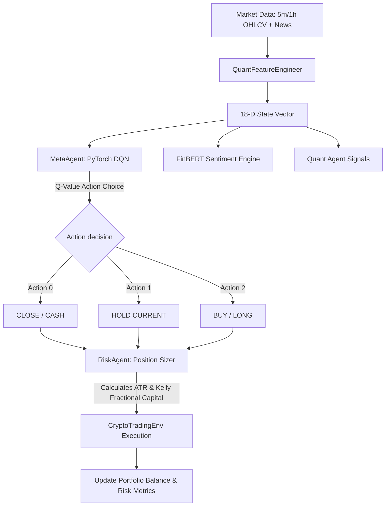

# 🚀 Institutional Multi-Asset AI Crypto Trading Platform (Universal Meta-DQN)

---

## 📌 Executive Summary

This platform is a state-of-the-art **Multi-Asset Deep Reinforcement Learning (DQN)** system engineered for cryptocurrency trading across **BTCUSDT, ETHUSDT, BNBUSDT, SOLUSDT, and XRPUSDT**. 

Unlike standard trading bots that rely on basic indicators or static neural networks, this architecture implements an **18-Dimensional Institutional Feature State Space**, combining:
1. Multi-timeframe trend indicators (5m to 1mo Z-Scores).
2. Volatility dynamics (ATR & multi-timeframe standard deviations).
3. Volume structure and liquidity spikes.
4. Macroeconomic indicators (S&P 500, DXY index correlation).
5. FinBERT NLP Sentiment Scores extracted from news & social media.
6. Institutional Risk Rules (3x max leverage, position sizing, circuit breakers).

The core decision-making brain is trained using an **Expanding Window Walk-Forward Optimization (2019–2026)** to completely eliminate AI amnesia and over-fitting.

---

## 🛠️ Core Technologies & AI Models Overview

### 💻 Technologies & Frameworks Used
* **Python 3.12+**: Core programming language for backtesting, data pipelines, and AI agent execution.
* **PyTorch (`torch.nn.Module`)**: Deep Learning framework used for Double Deep Q-Networks and Attention Transformers with CUDA GPU acceleration.
* **HuggingFace Transformers (`pipeline`)**: NLP framework hosting the pre-trained `ProsusAI/finbert` model for financial news sentiment analysis.
* **Pandas & NumPy**: High-performance quantitative data manipulation, vectorization, and matrix operations.
* **Scikit-Learn & SciPy**: Statistical calculations, feature scaling, Z-score standardization, and baseline ML models.
* **Next.js & React**: Modern frontend framework powering the real-time dark-mode trading dashboard.
* **Tailwind CSS & Recharts / Lightweight Charts**: Financial candlestick charts, live equity curve plots, and responsive UI components.
* **FastAPI & Uvicorn**: High-speed asynchronous Python web server exposing backend API endpoints.
* **ChromaDB Vector Store**: Vector database storing news headline embeddings for semantic memory context.
* **InfluxDB 2.0**: High-throughput time-series database for logging tick data, order execution events, and latency metrics.
* **Binance REST & WebSocket API (via `ccxt`)**: Exchange connectivity for downloading archival data and streaming live order book depth.

### 🤖 AI Models Implemented
1. **Multi-Asset Double Deep Q-Network (Double DQN)** ([`agents/meta_agent.py`](file:///c:/Users/ajayg/ai_crypto_bot/agents/meta_agent.py)): Central 18-input reinforcement learning agent using target network weight synchronization and experience replay memory.
2. **FinBERT NLP Transformer** ([`agents/sentiment_agent.py`](file:///c:/Users/ajayg/ai_crypto_bot/agents/sentiment_agent.py)): 12-layer financial BERT model extracting continuous sentiment scores from financial text.
3. **Multi-Head Temporal Self-Attention Transformer** ([`agents/transformer_agent.py`](file:///c:/Users/ajayg/ai_crypto_bot/agents/transformer_agent.py)): Sequence model evaluating multi-step temporal dependencies across 5-minute state vectors.
4. **Quant Multi-Timeframe Engine** ([`agents/quant_agent.py`](file:///c:/Users/ajayg/ai_crypto_bot/agents/quant_agent.py)): Algorithmic signal generator processing 15 timeframe Z-scores and volatility standard deviations.
5. **Support Vector Machine (SVM) Classifier** ([`training/test_svm.py`](file:///c:/Users/ajayg/ai_crypto_bot/training/test_svm.py)): Baseline quantitative machine learning model used to benchmark reinforcement learning performance.

---

## 🌳 Core Directory Structure Tree

```text
ai_crypto_bot/
│
├── agents/                           # Multi-Agent Intelligence Layer
│   ├── agent_orchestrator.py         # Multi-agent workflow coordinator
│   ├── cio_agent.py                  # Chief Investment Officer capital allocation
│   ├── compliance_agent.py           # Regulatory & exchange rule compliance
│   ├── crypto_sentiment_agent.py     # Social media & RSS news sentiment parser
│   ├── execution_agent.py            # Order placement & execution agent
│   ├── execution_algo_agent.py       # Algorithmic order slicing (TWAP/VWAP)
│   ├── market_regime_agent.py        # Volatility & trend regime classifier
│   ├── meta_agent.py                 # Central 18-D Double Deep Q-Network
│   ├── model_governance_agent.py     # Model validation & drift checking
│   ├── multistyle_trading_agent.py   # Multi-strategy coordinator (scalp/swing)
│   ├── performance_review_agent.py   # Trade history auditing & Sharpe calculation
│   ├── portfolio_management_agent.py # Cross-asset weight balancing
│   ├── quant_agent.py                # Technical indicator signal generator
│   ├── regime_agent.py               # Macro market state classifier
│   ├── research_agent.py             # Backtest hypothesis testing agent
│   ├── risk_agent.py                 # ATR stop-loss, position sizing, 3x leverage cap
│   ├── rl_agent.py                   # Reinforcement learning wrapper
│   ├── sentiment_agent.py            # HuggingFace FinBERT NLP sentiment analyzer
│   ├── supervisor_agent.py           # Agent hierarchy supervisor
│   ├── tca_agent.py                  # Transaction Cost Analysis agent
│   └── transformer_agent.py          # Temporal Self-Attention Transformer agent
│
├── backtesting/                      # Environment & Feature Engineering Layer
│   ├── backtest_lab.py               # Quantitative backtesting laboratory
│   ├── download_binance_zips.py      # Binance archival ZIP downloader
│   ├── download_data.py              # Historical OHLCV candle downloader
│   ├── download_news_sentiment.py    # Historical sentiment scraper
│   ├── google_news_patch.py          # News patch utility
│   ├── migrate_to_influx.py          # InfluxDB data migration tool
│   ├── patch_missing_news.py         # Missing news sentiment filler
│   ├── quant_features.py             # 15-Timeframe feature engineering engine
│   ├── run_multi_agent.py            # Multi-pair backtest launcher
│   ├── temporal_validator.py         # Walk-forward date range validator
│   ├── trading_env.py                # Gym-style multi-asset trading environment
│   └── wayback_patch.py              # Wayback Machine archive sentiment retriever
│
├── training/                         # AI Model Training & Evaluation Layer
│   ├── benchmark_models.py           # Baseline buy-and-hold benchmarks
│   ├── test_svm.py                   # Support Vector Machine comparison
│   ├── train_dqn.py                  # Universal Multi-Asset DQN Trainer
│   ├── train_transformer.py          # Temporal Transformer model trainer
│   └── walk_forward.py               # Expanding-window walk-forward optimizer
│
├── models/                           # Neural Network Architectures & Checkpoints
│   ├── factor_models.py              # Multi-factor asset pricing models
│   ├── portfolio_models.py           # Mean-variance & Kelly criterion optimization
│   ├── regime_models.py              # Hidden Markov & clustering regime models
│   ├── risk_models.py                # Value-at-Risk (VaR) & Expected Shortfall models
│   ├── rl_models.py                  # PyTorch QNetwork & Replay Buffer memory
│   ├── technical_indicators.py       # TA indicator vector formulas
│   └── weights/                      # Model Checkpoint Weights (*.pth)
│       └── universal_meta_agent.pth  # Trained Universal Brain Model
│
├── data/                             # Historical Datasets & Cache
│   ├── BNBUSDT_1h_historical.csv     # 1-Hour BNB OHLCV data
│   ├── BNBUSDT_5m_historical.csv     # 5-Minute BNB OHLCV data
│   ├── BNBUSDT_funding.csv           # BNB Futures funding rate
│   ├── BNBUSDT_sentiment_2019_2026.csv # Pre-computed BNB FinBERT sentiment
│   ├── BTCUSDT_1h_historical.csv     # 1-Hour BTC OHLCV data
│   ├── BTCUSDT_5m_historical.csv     # 5-Minute BTC OHLCV data
│   ├── BTCUSDT_funding.csv           # BTC Futures funding rate
│   ├── BTCUSDT_sentiment_2019_2026.csv # Pre-computed BTC FinBERT sentiment
│   ├── ETHUSDT_1h_historical.csv     # 1-Hour ETH OHLCV data
│   ├── ETHUSDT_5m_historical.csv     # 5-Minute ETH OHLCV data
│   ├── ETHUSDT_funding.csv           # ETH Futures funding rate
│   ├── ETHUSDT_sentiment_2019_2026.csv # Pre-computed ETH FinBERT sentiment
│   ├── SOLUSDT_1h_historical.csv     # 1-Hour SOL OHLCV data
│   ├── SOLUSDT_5m_historical.csv     # 5-Minute SOL OHLCV data
│   ├── SOLUSDT_funding.csv           # SOL Futures funding rate
│   ├── SOLUSDT_sentiment_2019_2026.csv # Pre-computed SOL FinBERT sentiment
│   ├── XRPUSDT_1h_historical.csv     # 1-Hour XRP OHLCV data
│   ├── XRPUSDT_5m_historical.csv     # 5-Minute XRP OHLCV data
│   ├── XRPUSDT_sentiment_2019_2026.csv # Pre-computed XRP FinBERT sentiment
│   └── macro_daily.csv               # S&P 500, DXY, and macro indicators
│
├── scripts/                          # Production Tools & Deployment Utilities
│   ├── convert_csv_to_lp.py          # Line protocol conversion for InfluxDB
│   ├── create_colab_zip.py           # Kaggle/Colab ZIP packaging tool
│   ├── live_trader.py                # Real-time exchange execution engine
│   ├── mlops_retrainer.py            # Automated model drift detector & retrainer
│   ├── start_influxdb.bat            # InfluxDB service launcher
│   └── sync_market_data.py           # Binance live candle sync script
│
├── tools/                            # Exchange API & Market Interfaces
│   ├── execution_tools.py            # Exchange order submission & cancel wrappers
│   ├── market_tools.py               # Real-time order book ticker & depth stream
│   └── news_tools.py                 # Live RSS news scraper
│
├── memory/                           # Vector Store & Context Memory
│   └── chroma_db_manager.py          # ChromaDB vector store manager for news embeddings
│
├── dashboard/ & frontend/            # Web User Interface & Monitoring Dashboard
│   ├── dashboard/app.py              # FastAPI server serving live metrics API
│   ├── dashboard/equity_endpoint.py  # Equity curve streaming endpoint
│   └── frontend/                     # Next.js React frontend dashboard (Dark Mode)
│
└── System Configuration & Documentation
    ├── config.py / config.yaml       # Master configuration (APIs, parameters)
    ├── Dockerfile / docker-compose.yml # Containerized deployment setup
    ├── requirements.txt              # Python library dependencies
    └── SYSTEM_DOCUMENTATION.md       # Complete technical manual & guide
```

---

## 📁 Detailed Module Purpose Reference

Below is the complete inventory of all key directories and files in the project workspace, explaining their exact purpose:

### 1. `agents/` — Multi-Agent Intelligence Layer
Contains individual domain-specific AI agents that collaborate to make trading and risk decisions.
* **`meta_agent.py`**: The central Deep Q-Network (Double DQN) brain (18-D state input $\rightarrow$ 3 action Q-values).
* **`quant_agent.py`**: Calculates multi-timeframe technical indicator signals and generates trend confidence.
* **`sentiment_agent.py`**: Runs HuggingFace FinBERT NLP model to extract sentiment scores from news headlines.
* **`risk_agent.py`**: Enforces position sizing rules, leverage caps (3x max), ATR volatility stops, and circuit breakers.
* **`cio_agent.py`**: Chief Investment Officer agent managing portfolio asset allocation across the 5 crypto assets.
* **`agent_orchestrator.py`**: Coordinates multi-agent workflows, data flow, and state extraction.
* **`execution_agent.py`** / **`execution_algo_agent.py`**: Calculates slippage, order-book liquidity impact, and limit order routing.
* **`crypto_sentiment_agent.py`**: Scrapes and analyzes raw sentiment from social media and news RSS feeds.
* **`market_regime_agent.py`** / **`regime_agent.py`**: Classifies market state into Bull, Bear, Sideways, or High-Volatility.
* **`performance_review_agent.py`**: Audits past trade executions, Sharpe ratios, and max drawdowns.
* **`multistyle_trading_agent.py`**: Coordinates scalp, swing, and trend-following strategies.

### 2. `backtesting/` — Simulation & Feature Engineering Environment
Simulates historical trade execution with realistic transaction costs, slippage, and funding rates.
* **`quant_features.py`**: Computes the 15 timeframe features (Z-scores, ATR, volume spikes) for state vector construction.
* **`trading_env.py`**: Gym-style environment (`reset()`, `step()`) that calculates portfolio equity, PnL, and step rewards.
* **`walk_forward.py`**: Manages the expanding-window historical backtest splits (2019–2026).
* **`run_multi_agent.py`**: Orchestrates backtest simulations across multiple trading pairs.
* **`temporal_validator.py`**: Ensures strictly non-overlapping train/validation date ranges to prevent look-ahead bias.
* **`download_data.py`** / **`download_binance_zips.py`**: Downloads raw 5m/1h OHLCV candlestick data from Binance public archives.

### 3. `training/` — AI Model Training Pipelines
Contains scripts dedicated to training, tuning, and evaluating AI networks.
* **`train_dqn.py`**: Primary universal trainer for the 18-D Double Deep Q-Network across all 5 assets.
* **`train_transformer.py`**: Trains temporal attention transformer networks for multi-step sequence predictions.
* **`benchmark_models.py`**: Runs baseline benchmark comparisons (e.g., Buy-and-Hold, Equal Weight Portfolio).
* **`test_svm.py`**: Trains Support Vector Machine baselines for classification comparison against the DQN.

### 4. `models/` — Neural Network Architectures & Checkpoints
Defines deep learning module structures and stores trained model weights.
* **`rl_models.py`**: PyTorch `QNetwork` classes, replay memory buffer, and policy network definitions.
* **`factor_models.py`**: Multi-factor valuation models.
* **`portfolio_models.py`**: Mean-variance and Kelly criterion mathematical optimization.
* **`weights/`**: Stores checkpoint files (*.pth) such as `universal_meta_agent.pth`.

### 5. `data/` — Historical Datasets & Cache
Storage directory for price CSVs, sentiment records, funding rates, and macro data.
* **`BTCUSDT_5m_historical.csv`, `ETHUSDT_5m_historical.csv`, ...**: 5-minute price OHLCV data.
* **`BTCUSDT_1h_historical.csv`, `ETHUSDT_1h_historical.csv`, ...**: 1-hour price OHLCV data.
* **`BTCUSDT_sentiment_2019_2026.csv`, ...**: Pre-computed daily FinBERT sentiment series.
* **`BTCUSDT_funding.csv`, ...**: Perpetual futures funding rate histories.
* **`macro_daily.csv`**: S&P 500, DXY, and macroeconomic indicators.

### 6. `scripts/` — System Tools & Production Utilities
Operational scripts for packaging, data sync, and live execution.
* **`create_colab_zip.py`**: Bundles code, data, and models into `colab_training_package.zip` for Kaggle/Colab GPU deployment.
* **`live_trader.py`**: Connects trained model weights to real-time market data for paper/live trading.
* **`mlops_retrainer.py`**: Monitors model drift and triggers automated retraining when Sharpe drops.
* **`sync_market_data.py`**: Fetches latest 5m candles from Binance API to update historical CSVs.

### 7. `tools/` — Exchange API & Data Access Helpers
* **`execution_tools.py`**: Wrappers for order submission, cancellation, and position tracking.
* **`market_tools.py`**: Real-time order book ticker & depth fetching routines.
* **`news_tools.py`**: RSS news feed parser for live sentiment evaluation.

### 8. `memory/` — Vector Storage & Persistent Context
* **`chroma_db_manager.py`**: Manages ChromaDB vector database embeddings for storing news sentiment context.

### 9. `dashboard/` & `frontend/` — Visual Web Interface
Next.js React frontend and Python FastAPI web server for real-time monitoring.
* **`frontend/`**: Modern dark-mode UI with Next.js, Tailwind CSS, and interactive charts (candlesticks, equity curves).
* **`dashboard/app.py`**: FastAPI backend serving portfolio metrics, active trade signals, and agent state logs.

---

## 🧠 The 18-Dimensional Brain (State Vector)

Every 5-minute candlestick step, the environment compiles an **18-element state vector** fed into the Neural Network:

| Index | Feature Name | Description / Range |
| :---: | :--- | :--- |
| `0` | `quant_confidence` | Quantitative Signal score from QuantAgent (`-1.0` to `+1.0`) |
| `1` | `sentiment_score` | FinBERT NLP sentiment score (`0.0` bear to `1.0` bull, `0.5` neutral) |
| `2` | `current_weight` | Current position weight relative to total portfolio balance |
| `3` | `1mo_z_score` | Monthly price distance relative to 30-day moving average |
| `4` | `1w_z_score` | Weekly trend Z-score |
| `5` | `3d_z_score` | 3-Day trend Z-score |
| `6` | `1d_z_score` | Daily trend Z-score |
| `7` | `12h_volatility` | 12-Hour normalized Standard Deviation |
| `8` | `8h_volatility` | 8-Hour normalized Standard Deviation |
| `9` | `6h_volatility` | 6-Hour normalized Standard Deviation |
| `10` | `4h_volatility` | 4-Hour normalized Standard Deviation |
| `11` | `2h_volatility` | 2-Hour normalized Standard Deviation |
| `12` | `1h_volatility` | 1-Hour normalized Standard Deviation |
| `13` | `30m_volume_spike` | Volume relative to 30-minute moving average volume |
| `14` | `15m_volume_spike` | Volume relative to 15-minute moving average volume |
| `15` | `5m_volume_spike` | Volume relative to 5-minute moving average volume |
| `16` | `3m_volume_spike` | Micro-volume surge detection |
| `17` | `1m_volume_spike` | Immediate order-flow volume surge |

---

## 📈 How the Multi-Agent System Works



### Action Space:
1. **`0` (FLAT / SELL):** Liquidate open position to cash.
2. **`1` (HOLD):** Maintain existing allocation.
3. **`2` (LONG):** Open or increase long exposure.

---

## 🔬 Training Pipeline (Walk-Forward Optimization)

### 1. Expanding Window Logic
To prevent AI amnesia (forgetting historical market crashes like 2020 or 2022), training runs sequentially through historical years from **2019 to 2026**:
* **Year 2019:** Train Jan–Sep -> Validate Oct–Dec -> Save Best Weights
* **Year 2020:** Train 2019-Jan to 2020-Sep (Expanding) -> Validate Oct–Dec
* **Year 2021 to 2026:** Continually expands historical context while evaluating on completely unseen future data.

### 2. Validation & Model Selection
* During validation, exploration rate $\epsilon = 0.0$ (pure exploitation).
* The model measures **Portfolio Sharpe Ratio** across all 5 assets.
* If a window produces a higher Sharpe ratio than the historical record, `universal_meta_agent.pth` is saved to disk.

---

## ⚡ How to Train on Kaggle GPU (Step-by-Step)

### Step 1: Re-pack ZIP Locally
On your local PC in terminal:
```powershell
.\venv\Scripts\python.exe scripts\create_colab_zip.py
```
*(Creates `colab_training_package.zip`)*

### Step 2: Upload to Kaggle Dataset
1. Go to [kaggle.com/datasets](https://www.kaggle.com/datasets).
2. Select your `crypto-training-data` dataset -> Click **New Version** -> Upload `colab_training_package.zip`.

### Step 3: Set Up Kaggle Notebook
1. Open your Kaggle Notebook.
2. Under **Input** (right sidebar), verify `crypto-training-data` is attached.
3. Under **Settings** -> **Accelerator**, choose **GPU T4 x2**.

### Step 4: Run Setup in Cell 1
```python
import os, shutil, zipfile

working_dir = "/kaggle/working"
print("Scanning Kaggle inputs...")

input_files = []
for root, dirs, files in os.walk("/kaggle/input"):
    for file in files:
        input_files.append(os.path.join(root, file))

zip_files = [f for f in input_files if f.endswith('.zip')]

if zip_files:
    print(f"Found zip package: {zip_files[0]}. Extracting...")
    with zipfile.ZipFile(zip_files[0], 'r') as zip_ref:
        zip_ref.extractall(working_dir)
else:
    print("Copying dataset directories directly...")
    source_root = None
    for file_path in input_files:
        if "train_dqn.py" in file_path:
            parts = file_path.split(os.sep)
            idx = parts.index("training") if "training" in parts else -1
            if idx > 0:
                source_root = os.sep.join(parts[:idx])
            break
            
    if not source_root:
        source_root = "/kaggle/input"
        
    for root, dirs, files in os.walk(source_root):
        rel_path = os.path.relpath(root, source_root)
        dest_dir = os.path.join(working_dir, rel_path)
        os.makedirs(dest_dir, exist_ok=True)
        for file in files:
            shutil.copy2(os.path.join(root, file), os.path.join(dest_dir, file))

os.makedirs(os.path.join(working_dir, "models", "weights"), exist_ok=True)
print("✅ SUCCESS! Setup complete.")
```

### Step 5: Start Training in Cell 2
```bash
!pip install -q pandas numpy torch scikit-learn transformers
!python /kaggle/working/training/train_dqn.py
```

### Step 6: Save & Run in Background
1. Click **Save Version** (top right).
2. Select **Save & Run All (Commit)** -> Advanced Settings: **Run with GPU**.
3. Click **Save**. You can safely close your browser!

---

## 🎯 Post-Training & Live Execution

Once Kaggle finishes:
1. Download `universal_meta_agent.pth` from your Kaggle notebook output.
2. Move it to your local workspace directory: `models/weights/universal_meta_agent.pth`.
3. Launch the live trading bot / dashboard:
   ```powershell
   .\venv\Scripts\python.exe scripts\live_trader.py
   ```
