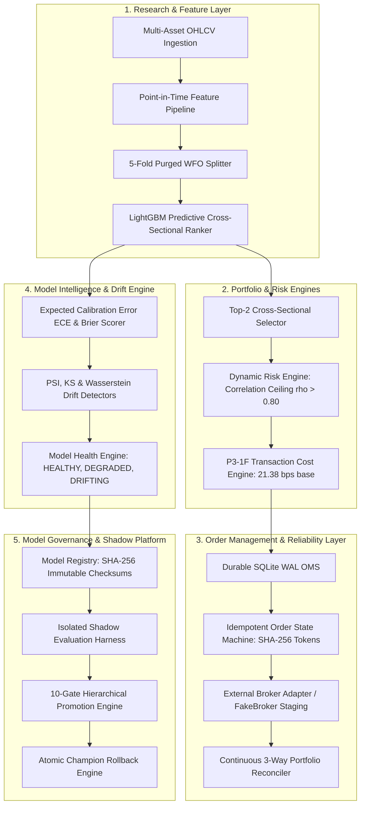

# System Architecture & Technical Specifications

## 1. High-Level Architecture Overview

The **AI Trading Research & Model Governance Platform** is structured into five decoupled, highly modular subsystems:

---

## 2. Core Subsystem Responsibilities

### Subsystem 1: Research & Feature Pipeline
- Ingests canonical 13-asset OHLCV hourly data.
- Computes point-in-time features (volatility, momentum, volume ratios) fitted strictly on in-sample training folds.
- Implements 5-Fold Purged Walk-Forward Optimization with 24-bar embargo buffers to prevent temporal leakage.

### Subsystem 2: Portfolio & Risk Management
- Selects the Top-2 ranked assets on a 48-hour rebalancing cadence.
- Implements dynamic correlation ceilings ($\rho > 0.80$) and macro BTC regime conditioning (Bull, Sideways, Bear).
- Applies institutional-grade transaction cost friction (10 bps fee + 5 bps spread + 6.38 bps slippage = 21.38 bps one-way base).

### Subsystem 3: Execution Reliability & Order Management System (OMS)
- Backed by durable SQLite with Write-Ahead Logging (`PRAGMA synchronous=FULL`).
- Enforces deterministic SHA-256 client order ID tokens for 100% duplicate-execution prevention.
- Handles partial fills, timeouts, cancellation races, and crash recovery.
- Runs continuous 3-way reconciliation comparing internal OMS against external broker snapshots.

### Subsystem 4: Model Intelligence, Calibration & Drift
- Evaluates probability calibration via Brier Score and Expected Calibration Error ($\text{ECE} \le 0.08$).
- Detects feature and prediction distribution drift using Population Stability Index (PSI), Kolmogorov-Smirnov (KS) tests, and Wasserstein distance.
- Categorizes model operational health into 5 discrete states (`HEALTHY`, `DEGRADED`, `DRIFTING`, `UNRELIABLE`, `SUSPENDED`).

### Subsystem 5: Model Governance & Shadow Deployment
- Maintains an immutable Model Registry enforcing the Unique Champion Invariant ($\le 1$ active Champion per family).
- Runs candidate Challenger models in an isolated shadow execution harness with proven bitwise non-interference.
- Enforces a 10-Gate Fail-Closed Promotion Hierarchy requiring passing scores across artifact integrity, leakage checks, calibration, confidence, health, economics, risk limits, latency, shadow duration, and governance approvals.
- Provides atomic rollback to previous Champion versions with full audit trail persistence.
