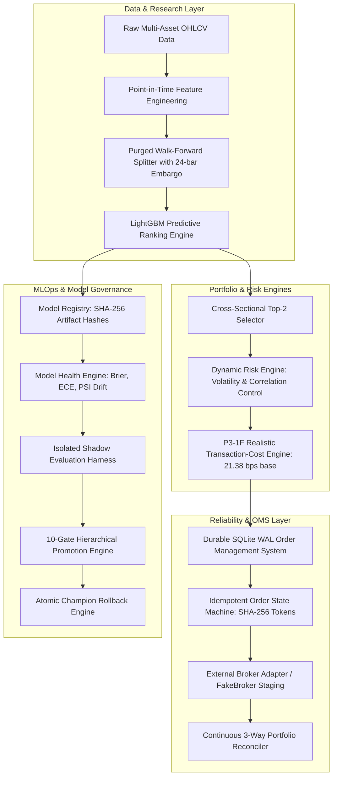

# Building a Research-Grade ML Trading Platform: From Leakage-Controlled Validation to Model Governance

## 1. Problem Statement & Engineering Motivation

Most machine learning applications in finance follow a flawed, toy workflow: raw price data is ingested, standard $k$-fold cross-validation is performed, high in-sample accuracy or Sharpe ratios are claimed, and models are deployed directly to live markets where they immediately collapse. 

In real-world quantitative systems, model failure rarely stems from algorithm choice; it stems from **subtle data leakage**, **unmodeled market friction (transaction costs and slippage)**, **uncontrolled portfolio concentration**, **brittle execution systems prone to duplicate orders during network drops**, **unmonitored probability calibration breakdown**, and **the absence of fail-closed model governance**.

To solve these systemic problems, we engineered the **AI Trading Research & Model Governance Platform**—an institutional-grade quantitative machine learning and MLOps system built in Python. The platform unifies:
1. Strictly purged and embargoed walk-forward research validation across a 13-asset crypto universe.
2. Realistic transaction-cost and market-friction intelligence.
3. Correlation-aware dynamic risk management.
4. ACID-compliant, crash-resilient, idempotent paper execution with external broker reconciliation.
5. Continuous probability calibration and distribution drift monitoring.
6. A 10-gate Champion/Challenger model governance framework with isolated shadow deployment and atomic rollback.

---

## 2. End-to-End System Architecture

---

## 3. Research Integrity & Leakage Prevention

Financial time-series data suffers from severe serial correlation. Standard cross-validation causes future label leakage across split boundaries.

To guarantee zero lookahead bias, we implemented:
- **5-Fold Purged Walk-Forward Optimization (WFO)**: Strictly chronological training and validation folds.
- **24-Bar Embargo Buffer**: A 24-hour blackout window placed between training and test sets to eliminate autoregressive label overlap.
- **Point-in-Time Feature Normalization**: Feature scalers and rolling indicators fitted strictly on training fold observations.
- **Counterfactual Future-Mutation Testing**: Automated unit tests that mutate post-$t$ future data and verify that decisions computed at timestamp $t$ remain bitwise invariant.

---

## 4. Cross-Sectional Portfolio Modeling

Instead of predicting absolute single-asset price directions (which suffer from low signal-to-noise ratios), the platform models **relative cross-sectional momentum**:
- **Universe**: 13 canonical crypto assets (`BTC`, `ETH`, `SOL`, `BNB`, `XRP`, `DOGE`, `ADA`, `AVAX`, `LINK`, `NEAR`, `LTC`, `DOT`, `SUI`).
- **Strategy**: Long-Only Top-2, Equal Weight (50% / 50%).
- **Rebalance Cadence**: Fixed 48-hour cadence, executing on the $t+1$ bar open.

---

## 5. Transaction-Cost Realism & The P3-1F Audit

In Phase P3-1, we introduced realistic transaction cost modeling. During the P3-1F integrity audit, we discovered that an explicit execution delay penalty term double-counted the execution gap, as portfolio P&L already started at the execution bar open ($t+1$).

We corrected the model to the **P3-1F Base Model**:
$$\text{Cost}_{\text{one-way}} = 10.0\text{ bps (Exchange Fee)} + 5.0\text{ bps (Half-Spread)} + 6.38\text{ bps (Volatility Slippage)} = 21.38\text{ bps}$$
Round-trip friction is strictly **42.76 bps**. This cost model revealed that high-frequency rebalancing (1-hour) eroded -90.8% of portfolio equity, whereas 48-hour rebalancing preserved positive net edge (+11.96% net return, 2.61 Net Sharpe).

---

## 6. Dynamic Risk & Portfolio Intelligence

Phase P3-2 introduced correlation-aware risk management:
- **Correlation Ceiling**: When Top-2 selected assets exhibit rolling 24-hour return correlation $\rho > 0.80$, portfolio concentration risk is mitigated by scaling exposure down.
- **Regime Conditioning**: Exposure is conditioned on macro BTC trend regimes (Bull, Sideways, Bear).
- **Audit Finding**: Pure inverse-volatility sizing and aggressive cash-drag configurations degraded net Sharpe relative to 50/50 baseline sizing due to unnecessary turnover friction. The 50/50 Top-2 baseline was frozen as the optimal risk-adjusted structure.

---

## 7. Execution Reliability, State Machines & Reconciliation

Phase P2 hardened execution to institutional reliability standards:
- **ACID Order Management System (OMS)**: Backed by SQLite WAL journaling (`PRAGMA synchronous=FULL`).
- **Idempotency & Deduplication**: Deterministic SHA-256 client order ID tokens eliminate double-fills across retries.
- **State Machine Transitions**: Handles partial fills, timeouts, cancellations, and UNKNOWN states.
- **Continuous 3-Way Reconciliation**: Compares internal OMS state against authoritative external broker snapshots every cycle, enforcing balance sheet conservation:
  $$\text{Cash}_{\text{final}} = \text{Cash}_{\text{init}} - \sum \text{Buys} + \sum \text{Sells} - \sum \text{Fees}$$
- **Crash Recovery**: Validated in Phase P2-8 across a 168-hour continuous soak test with 18 scheduled fault injections and process restarts.

---

## 8. Model Intelligence, Calibration & Distribution Drift

Standard ML metrics (AUC-ROC, accuracy) fail to measure probability fidelity. Phase P3-3 implemented:
- **Calibration Engine**: Expected Calibration Error ($\text{ECE} \le 0.08$), Maximum Calibration Error (MCE), Brier Score, and Platt scaling.
- **Confidence Monotonicity**: Verifying that higher prediction probability buckets produce monotonically higher forward returns.
- **Drift Detection**: Population Stability Index (PSI), Kolmogorov-Smirnov (KS) tests, and Wasserstein distance tracking for feature and prediction distributions.
- **Health Engine**: Multi-state model classification (`HEALTHY`, `DEGRADED`, `DRIFTING`, `UNRELIABLE`, `SUSPENDED`).

---

## 9. Champion / Challenger Governance & Shadow Evaluation

Phase P3-4 established the model lifecycle framework:
- **Model Registry**: Immutable records with SHA-256 artifact checksums and unique Champion invariant enforcement.
- **Isolated Shadow Evaluation**: Challenger models run side-by-side on live streaming features, recording predictions and hypothetical portfolios with **zero order execution and zero account balance mutation** (proven bitwise non-interference).
- **10-Gate Fail-Closed Promotion Hierarchy**: Requiring candidate models to pass Artifact Integrity, Research Integrity, Calibration, Confidence Monotonicity, Drift/Health, Economic Performance, Risk Limits, Operational Latency ($\le 50\text{ms}$), Shadow Duration, and Governance Approval.
- **Atomic Rollback**: Verified pointer swap returning to previous approved Champions instantly.

---

## 10. P4-1 Extended Unseen Longitudinal Validation Study

To prove the longitudinal stability of the system, Phase P4-1 evaluated the Champion (`MOD-P33-LGBM-CHAMPION`, v1.0.0) against the Challenger (`MOD-CHALLENGER-A-CALIBRATED`, v1.1.0-challenger.a) across **1819 hourly bars** (**75.8 days** / **37 rebalance cycles**) of genuinely unseen out-of-sample data (23,647 predictions).

### Empirical Findings:
- **Behavioral Agreement**: 98.13% directional agreement, 0.8378 Top-2 selection Jaccard similarity, 0.9913 prediction correlation.
- **Operational Performance**: P50 latency 1.21 ms, P95 latency 1.89 ms, 0.0% error rate.
- **Macro Downtrend Performance**:
  - Champion: Net Return **-30.71%**, Net Sharpe **-2.86**, Max Drawdown **32.29%**
  - Challenger: Net Return **-25.05%**, Net Sharpe **-2.11**, Max Drawdown **27.82%**
- **Governance Decision**: While the Challenger preserved +5.66% more capital and suffered 4.47% less drawdown than the Champion, the **Promotion Gate Replay issued a strict REJECT** because both models experienced absolute drawdowns exceeding the strict 20.0% risk limit (**Gate 7: Risk Gate FAIL**).
- **Core Governance Takeaway**: The governance framework successfully prevented automatic model promotion during an uncontained macro drawdown regime, proving that fail-closed risk controls strictly override return-only metrics.

---

## 11. What Failed: Negative Results & Research Integrity

A core mark of engineering integrity is preserving and learning from negative results:
1. **1-Hour Rebalancing**: Failed under transaction costs (-90.8% return) due to turnover drag.
2. **Long/Short Top-2/Bottom-2**: Failed due to severe borrow fee friction and short-side crypto squeeze asymmetry.
3. **Inverse-Volatility Sizing**: Failed to improve Sharpe ratio over 50/50 equal weighting.
4. **Defensive Cash-Drag Configurations**: Reduced total return without providing proportional downside protection.
5. **Overfitted Candidate Promotion**: High gross-return candidates (+25.0% return) were rejected by Gate 3 and Gate 7 due to poor calibration ($\text{ECE} = 0.18$) and excessive drawdown (32.0%).

---

## 12. Key Engineering Lessons

1. **Transaction costs dictate strategy viability**: A model with high predictive accuracy can be completely unprofitable if turnover friction is unmodeled.
2. **Model governance must be separate from model training**: Training algorithms optimize loss functions; governance engines enforce operational safety, risk limits, and business invariants.
3. **Shadow systems must have strict physical isolation**: Candidate models must be incapable of modifying the live execution path.
4. **Durable state beats in-memory caches**: Following a process crash, recovering state from an ACID-compliant WAL journal is the only reliable way to prevent duplicate orders and orphan positions.
5. **Negative results are research assets**: Documenting why an architecture failed prevents costly regressions.

---

## 13. System Verification & Test Suite

The platform is validated by a 402-test automated suite:
- **Data & Feature Integrity**: 15 tests
- **Leakage & Embargo Audits**: 8 tests
- **Backtesting & Portfolio Accounting**: 4 tests
- **Risk & Dynamic Sizing**: 5 tests
- **OMS & Idempotent Execution**: 8 tests
- **Paper Trading, Crash Recovery & Reconciliation**: 324 tests
- **Calibration, Drift & Model Health**: 16 tests
- **Model Lifecycle, Promotion Gates & Rollback**: 13 tests
- **Longitudinal Shadow Evaluation & Integrity**: 5 tests
- **Regression Status**: **402 / 402 passing (0 errors, 0 warnings, 0 regressions)**.

---

## 14. Technical Stack

- **Languages**: Python 3.12, SQL
- **Machine Learning**: LightGBM, Scikit-learn, NumPy, Pandas
- **Backend & APIs**: FastAPI, Pydantic, Uvicorn
- **Data Persistence**: SQLite (WAL mode, ACID compliance)
- **Testing & Reliability**: Pytest, Pytest-Asyncio
- **Observability**: Prometheus metrics exporter, structured JSON logging
- **Deployment**: Oracle Cloud Infrastructure, PM2, Nginx, Git
