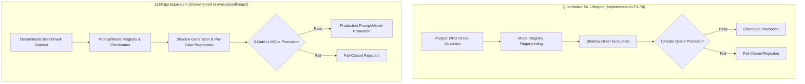

# LLMOps & GenAI Governance Equivalence Guide

> **Core Disclosure**: This project is primarily a quantitative machine learning, backend reliability, and MLOps platform. The following mapping demonstrates how its core lifecycle, validation, and governance architecture directly translate to LLM, agentic, and GenAI evaluation systems.

---

## 1. Architectural Transferability

In both quantitative ML and Large Language Model (LLM) platforms, the central engineering challenge is the same: **how to safely evaluate, validate, compare, promote, and roll back non-deterministic models in production without causing regressions, outages, or catastrophic failures.**

The 10-Gate Promotion Hierarchy and Shadow Evaluation subsystem implemented in this platform transfer directly to LLM and AI agent governance workflows.

---

## 2. Component Equivalence Matrix

| Quantitative ML Subsystem | LLMOps / GenAI Platform Equivalent | Architectural Invariant | Implementation in Repo |
|---|---|---|---|
| **Champion Model** | Production Prompt / LLM Configuration | The active, serving baseline against which all new candidates are benchmarked. | [`evaluation/model_registry.py`](file:///c:/Users/ajayg/ai_crypto_bot/evaluation/model_registry.py) / [`evaluation/llmops/evaluator.py`](file:///c:/Users/ajayg/ai_crypto_bot/evaluation/llmops/evaluator.py) |
| **Challenger Model** | Candidate Prompt / Fine-tuned LLM Version | The candidate pipeline being tested for quality, regression, safety, latency, and cost. | [`training/p4_1_extended_shadow.py`](file:///c:/Users/ajayg/ai_crypto_bot/training/p4_1_extended_shadow.py) / [`evaluation/llmops/evaluator.py`](file:///c:/Users/ajayg/ai_crypto_bot/evaluation/llmops/evaluator.py) |
| **Model Registry** | Prompt & LLM Artifact Registry | Immutable, SHA-256 fingerprinted store of model weights, system prompts, schemas, and scoring configs. | [`evaluation/model_registry.py`](file:///c:/Users/ajayg/ai_crypto_bot/evaluation/model_registry.py) |
| **Shadow Evaluation** | Shadow Traffic / Dual-Run Inference | Running candidate models asynchronously against live/staged inputs with zero side-effects on primary serving. | [`evaluation/shadow_evaluation.py`](file:///c:/Users/ajayg/ai_crypto_bot/evaluation/shadow_evaluation.py) / [`evaluation/llmops/governance.py`](file:///c:/Users/ajayg/ai_crypto_bot/evaluation/llmops/governance.py) |
| **Probability Calibration (ECE)** | LLM Confidence & Grounding Scoring | Measuring whether model confidence matches observed accuracy and context grounding (anti-hallucination). | [`evaluation/calibration.py`](file:///c:/Users/ajayg/ai_crypto_bot/evaluation/calibration.py) / [`evaluation/llmops/metrics.py`](file:///c:/Users/ajayg/ai_crypto_bot/evaluation/llmops/metrics.py) |
| **Feature & Prediction Drift (PSI)** | Input Prompt & Output Semantic Drift | Detecting distribution shifts in user queries, topic clusters, or token distributions over time. | [`evaluation/drift_detection.py`](file:///c:/Users/ajayg/ai_crypto_bot/evaluation/drift_detection.py) |
| **Promotion Gates** | LLM Release & Safety Gates | Automated, fail-closed policy checks (Quality, Safety Refusal, Regression Rate, Latency SLA, Cost Ratio). | [`evaluation/promotion_gates.py`](file:///c:/Users/ajayg/ai_crypto_bot/evaluation/promotion_gates.py) / [`evaluation/llmops/governance.py`](file:///c:/Users/ajayg/ai_crypto_bot/evaluation/llmops/governance.py) |
| **Atomic Rollback** | Instant Prompt/Model Rollback | Reverting traffic routing to the previous verified Champion with zero downtime upon anomaly detection. | [`evaluation/promotion_gates.py`](file:///c:/Users/ajayg/ai_crypto_bot/evaluation/promotion_gates.py) |
| **Broker Fault Injection** | Upstream LLM API & Tool Fault Injection | Simulating rate limits (HTTP 429), timeouts, truncated JSON, and provider outages to verify resilience. | [`execution/broker_adapter.py`](file:///c:/Users/ajayg/ai_crypto_bot/execution/broker_adapter.py) |
| **3-Way Reconciliation** | External State & Tool Call Reconciliation | Verifying that tool-call actions, state transitions, and external database updates balance cleanly. | [`reconciliation/portfolio_reconciler.py`](file:///c:/Users/ajayg/ai_crypto_bot/reconciliation/portfolio_reconciler.py) |

---

## 3. What Does NOT Transfer Directly

To maintain scientific credibility, domain-specific quantitative concepts must **not** be conflated with generic LLM metrics:

1. **Financial Drawdown & Sharpe Ratio**: Max drawdown ($D_{\max}$) and Sharpe ratio measure capital risk over time in a financial series. In LLMs, risk is measured via safety compliance, refusal rates, toxicity, and per-case output regressions.
2. **Transaction Costs & Slippage**: 21.38 bps trading friction models bid-ask spread and market impact. In LLMOps, operational friction corresponds to token ingestion/generation costs ($/1k tokens), API rate-limit quotas, and P95 latency overhead.
3. **Portfolio Correlation Constraints**: Pairwise asset correlation ceilings ($\rho > 0.80$) govern portfolio risk concentration. In LLMOps, output diversity or embedding similarity matrices measure topic concentration or response variance.

---

## 4. Implemented LLMOps Subsystem

The repository includes a dedicated, provider-agnostic LLM evaluation module located in [`evaluation/llmops/`](file:///c:/Users/ajayg/ai_crypto_bot/evaluation/llmops/):

1. **Deterministic Benchmark Dataset** ([`evaluation/llmops/dataset.py`](file:///c:/Users/ajayg/ai_crypto_bot/evaluation/llmops/dataset.py)):
   - 16 curated test cases spanning Factual QA, Instruction Following, Structured JSON Extraction, Refusal/Safety Compliance, and Context Grounding / Hallucination Resistance.
2. **Deterministic Evaluation Metrics** ([`evaluation/llmops/metrics.py`](file:///c:/Users/ajayg/ai_crypto_bot/evaluation/llmops/metrics.py)):
   - Exact match, token-level Jaccard overlap, JSON schema key validation, proxy context grounding, safety refusal compliance, latency percentiles (P50/P95), and token cost accounting.
3. **Per-Case Regression Analysis** ([`evaluation/llmops/regression.py`](file:///c:/Users/ajayg/ai_crypto_bot/evaluation/llmops/regression.py)):
   - Detects specific cases where a Challenger model degrades relative to Champion baseline.
4. **5-Gate Fail-Closed Governance Engine** ([`evaluation/llmops/governance.py`](file:///c:/Users/ajayg/ai_crypto_bot/evaluation/llmops/governance.py)):
   - Enforces Gate-1 (Quality $\ge 0.80$), Gate-2 (Regression Rate $\le 5\%$), Gate-3 (Safety Compliance $= 100\%$), Gate-4 (P95 Latency $\le 250\text{ ms}$), and Gate-5 (Cost Ratio $\le 1.25\times$).
   - Generates machine-readable governance artifacts in [`results/llmops/sample_evaluation.json`](file:///c:/Users/ajayg/ai_crypto_bot/results/llmops/sample_evaluation.json).
