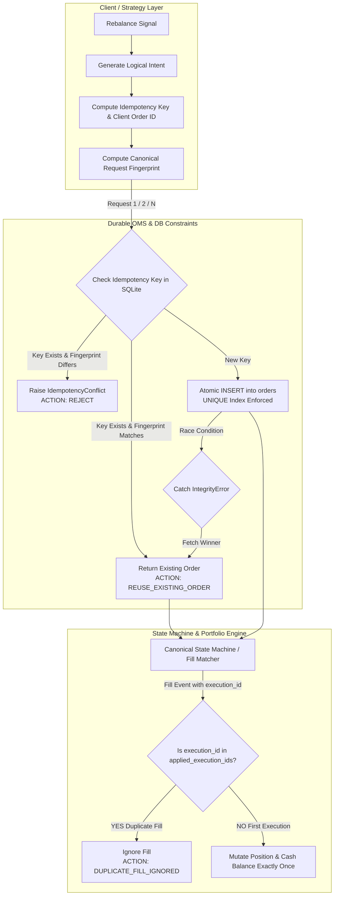

# P2-2: Order Idempotency & Duplicate-Execution Protection

## 1. Executive Summary & Objective

The primary objective of **P2-2** is to establish end-to-end duplicate-execution protection and deterministic order idempotency across the entire paper-trading lifecycle.

### Core Guarantee
$$\text{1 Logical Order Intent} \xrightarrow{\quad N\text{ Duplicate Requests / Fills}\quad} \text{1 Economic Execution} \xrightarrow{\quad\quad} \text{1 Portfolio Mutation}$$

The system rigorously decouples the transport layer (where retries, network glitches, or repeated HTTP/WS payloads may arrive multiple times) from the economic ledger (where cash balances, position sizes, realized P&L, and transaction fees must mutate strictly once).

---

## 2. Existing OMS Architecture & Idempotency Model

Prior to P2-2, the system relied on memory-level event tracking (`order._processed_event_ids`) introduced in P2-1. However, transport-level retries creating orders anew would generate fresh autoincrementing database IDs, causing duplicate orders and multi-fills across independent requests or across process restarts.

### P2-2 Disambiguation Hierarchy
1. **Logical Order Intent**: The fundamental quantitative decision to take or adjust exposure (e.g. `BUY 0.50 BNB/USDT` for rebalance cycle `20261007T120000`).
2. **Transport Request**: A client/daemon invocation attempting to submit or check an order.
3. **Lifecycle Event**: An asynchronous state notification (`SUBMIT`, `ACKNOWLEDGE`, `PARTIAL_FILL`, `FILL`, `CANCEL`).
4. **Economic Execution**: A distinct fill event with a unique `execution_id` modifying position and cash balances.



---

## 3. Logical Order Identity & Idempotency Key Design

An idempotency key uniquely represents an economic trading instruction across strategy cycles:

$$\text{IdempotencyKey} = \text{SHA256}(\text{strategy\_id} \mathbin{\Vert} \text{strategy\_version} \mathbin{\Vert} \text{rebalance\_id} \mathbin{\Vert} \text{signal\_id} \mathbin{\Vert} \text{symbol} \mathbin{\Vert} \text{side})_{[:16]}$$

### Implementation
```python
def generate_idempotency_key(
    strategy_id: str,
    symbol: str,
    side: Union[OrderSide, str],
    rebalance_id: str,
    signal_id: Optional[str] = None,
    strategy_version: str = "v1"
) -> str:
    norm_symbol = symbol.upper().replace(":", "").replace("/", "")
    norm_side = side.value if isinstance(side, OrderSide) else str(side).upper()
    raw = f"{strategy_id}|{strategy_version}|{rebalance_id}|{signal_id or ''}|{norm_symbol}|{norm_side}"
    digest = hashlib.sha256(raw.encode("utf-8")).hexdigest()[:16]
    return f"IDEMP-{digest}"
```

---

## 4. Client Order ID Standard

The `client_order_id` is human-readable, deterministic, and compatible with spot/futures exchange client ID formats:

$$\text{ClientOrderID} = \text{STRAT\_YYYYMMDD\_SYMBOL\_SIDE\_SEQ}$$
Example: `CS48H_20261007_BTCUSDT_BUY_001`

---

## 5. Canonical Request Fingerprinting & Conflict Handling

To prevent key collision or unintended parameter alteration (e.g. submitting a key as `BUY 1.0 BTC` and subsequently resubmitting the identical key as `SELL 1.0 BTC` or `BUY 2.0 BTC`), every request computes a canonical fingerprint:

$$\text{RequestFingerprint} = \text{SHA256}(\text{symbol} \mathbin{\Vert} \text{side} \mathbin{\Vert} \text{qty} \mathbin{\Vert} \text{price} \mathbin{\Vert} \text{type} \mathbin{\Vert} \text{strategy\_id} \mathbin{\Vert} \text{rebalance\_id})$$

### Conflict Policy
- If incoming `idempotency_key` exists in DB:
  - If `existing_fingerprint == incoming_fingerprint` $\implies$ **Idempotent Reuse** (returns existing order without side effects).
  - If `existing_fingerprint \ne incoming_fingerprint` $\implies$ **`IdempotencyConflict` Domain Error** (explicitly rejected, zero mutation).

---

## 6. Database Constraints & Concurrent Race Protection

### Additive SQLite Schema & Unique Indexes
Zero breaking migrations were applied to [`oms.db`](file:///c:/Users/ajayg/ai_crypto_bot/oms.db):
```sql
ALTER TABLE orders ADD COLUMN idempotency_key TEXT;
ALTER TABLE orders ADD COLUMN client_order_id TEXT;
ALTER TABLE orders ADD COLUMN request_fingerprint TEXT;
ALTER TABLE executions ADD COLUMN execution_id TEXT;

CREATE UNIQUE INDEX IF NOT EXISTS idx_orders_idempotency_key 
    ON orders(idempotency_key) WHERE idempotency_key IS NOT NULL;
CREATE UNIQUE INDEX IF NOT EXISTS idx_orders_client_order_id 
    ON orders(client_order_id) WHERE client_order_id IS NOT NULL;
CREATE UNIQUE INDEX IF NOT EXISTS idx_executions_execution_id 
    ON executions(execution_id) WHERE execution_id IS NOT NULL;
```

### Race Resolution
Under heavy multi-threaded or multi-process concurrency (e.g., 100 simultaneous threads submitting identical orders), the first insert wins. Subsequent concurrent threads encounter `sqlite3.IntegrityError`, rollback cleanly, query the existing winning order, verify the fingerprint, and return the single persisted order record.

---

## 7. Execution Deduplication & Portfolio Double-Counting Protection

The `PaperPortfolioManager` maintains a set of `applied_execution_ids`:
```python
def apply_order_fill(self, order: PaperOrder, fill_qty: float, fill_price: float, fee: float = 0.0, execution_id: Optional[str] = None):
    if execution_id and execution_id in self.applied_execution_ids:
        logger.warning(f"DUPLICATE_FILL_IGNORED execution_id={execution_id} order_id={order.order_id}")
        return
    ...
```

### Protected Invariants
1. **Position Sizing**: Replaying a fill 100 times will not inflate the position beyond the true executed quantity.
2. **Cash Conservation**: Cash is debited (for buy) or credited (for sell) strictly once.
3. **Transaction Fees**: 12 bps baseline fee is charged exactly once per unique fill.
4. **Realized P&L**: Closing fills compute realized profit/loss strictly once.

---

## 8. Test & Validation Summary

Dedicated test suite [`tests/paper_trading/test_idempotency.py`](file:///c:/Users/ajayg/ai_crypto_bot/tests/paper_trading/test_idempotency.py) provides 10 rigorous test cases:
1. `test_single_duplicate_order_request`: Verifies single duplicate request returns existing order.
2. `test_repeated_duplicate_order_requests`: Verifies 3 repeated requests yield 1 DB order.
3. `test_hundred_sequential_duplicate_requests`: 100 sequential duplicate submissions yield exactly 1 order record.
4. `test_concurrent_duplicate_requests_race_condition`: 100 concurrent worker threads submitting the identical key produce exactly 1 order.
5. `test_idempotency_conflict_detection`: Reusing key with different quantity/side is safely rejected with `IdempotencyConflict`.
6. `test_different_intents_remain_distinct`: Verifies separate cycles/symbols receive unique orders.
7. `test_database_uniqueness_constraint_enforcement`: Direct SQL insert violates unique index.
8. `test_duplicate_execution_fill_idempotency`: Duplicate fill events do not double-count position or deduct extra cash.
9. `test_duplicate_event_replay_lifecycle`: Full replay of `CREATE -> SUBMIT -> ACK -> FILL -> FILL...` maintains invariant.
10. `test_persistence_round_trip_with_idempotency_fields`: Full round-trip validation of keys, client IDs, and fingerprints.
11. `test_core_oms_wrapper_idempotency`: High-level wrapper integration and execution deduplication.
12. `test_staging_load_10_logical_orders_100_duplicates`: Staging load test with 1,000 total submissions across 10 distinct orders.

---

## 9. Scope & Deferred P2 Roadmap Items

The following features remain explicitly deferred to subsequent phases:
- **P2-3**: Complex partial fill slicing & exchange rejection code mapping.
- **P2-4**: Crash recovery & journal replay on startup.
- **P2-5**: Market data WebSocket heartbeat & stale quote fallback.
- **P2-6**: Broker API fault & latency injection.
- **P2-7**: Continuous portfolio reconciliation against live exchange balances.
- **P2-8**: 7-day soak testing under real-time simulated conditions.
