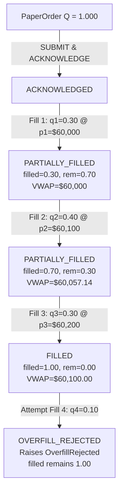
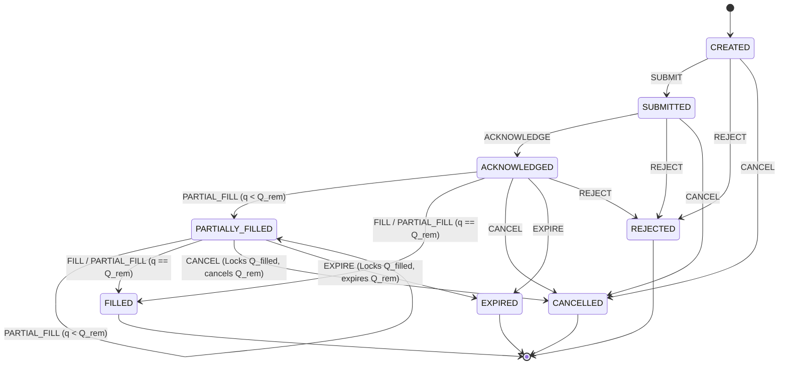

# P2-3: Partial Fills, Cancellations, Expirations & Rejection Lifecycle

## 1. Executive Summary & Objective

The primary objective of **P2-3** is to guarantee the correctness, safety, and accounting integrity of complex, multi-step order execution lifecycles in the paper-trading engine.

### Core Mathematical Invariant
For every order with total quantity $Q_{\text{order}}$:

$$Q_{\text{filled}} = \sum_{i=1}^{k} q_i \quad \text{where } q_i \text{ is the unique accepted execution quantity}$$

$$\text{Subject to the invariant: } 0 \le Q_{\text{filled}} \le Q_{\text{order}} \quad \text{and} \quad Q_{\text{remaining}} = Q_{\text{order}} - Q_{\text{filled}} \ge 0$$

Under no circumstances (including transport duplication, out-of-order delivery, or concurrent fill attempts) can $Q_{\text{filled}}$ exceed $Q_{\text{order}}$ or double-count economic effects.

---

## 2. Existing P2-1 / P2-2 Foundation

P2-3 builds directly on the formal state machine ([`execution/paper_state_machine.py`](file:///c:/Users/ajayg/ai_crypto_bot/execution/paper_state_machine.py)) and idempotency subsystem established in P2-1 and P2-2:
- **P2-1 Foundation**: Formal `OrderState` enums, explicit transition table `LEGAL_TRANSITIONS`, terminal state inviolability, and single transition function `PaperStateMachine.transition_order()`.
- **P2-2 Foundation**: Deterministic logical order keys, stable `client_order_id`, request fingerprinting, SQLite unique indexes, and `execution_id` deduplication.

---

## 3. The Multi-Execution Model

An order lifecycle is partitioned across discrete atomic executions:

Each fill record [`OrderExecution`](file:///c:/Users/ajayg/ai_crypto_bot/execution/paper_state_machine.py#L205) is immutable and contains:
- `execution_id`: Unique identifier (protected against replay).
- `order_id`: Parent order reference.
- `fill_price`: Fill price ($p_i > 0$).
- `fill_qty`: Executed quantity ($0 < q_i \le Q_{\text{remaining}}$).
- `fee`: Exact transaction fee ($12\text{ bps}$ baseline).
- `timestamp`: UTC ISO timestamp.

---

## 4. Partial Fill State Transitions

---

## 5. Multi-Price Volume-Weighted Average Price (VWAP)

When an order executes across multiple fills at varying prices, the average fill price is calculated strictly as the volume-weighted average of unique accepted executions:

$$\overline{P}_{\text{VWAP}} = \frac{\sum_{i=1}^{k} (q_i \cdot p_i)}{\sum_{i=1}^{k} q_i}$$

*Example Verification*:
- Fill 1: $0.30\text{ BTC} @ \$60,000 \implies \$18,000$
- Fill 2: $0.40\text{ BTC} @ \$60,100 \implies \$24,040$
- Fill 3: $0.30\text{ BTC} @ \$60,200 \implies \$18,060$
$$\overline{P} = \frac{18000 + 24040 + 18060}{1.00} = \frac{60100}{1.00} = \$60,100.00$$

VWAP strictly excludes duplicate executions, rejected executions, or cancelled quantities.

---

## 6. Cancellation & Expiration Semantics

### Cancellation Semantics
1. **Cancel Before Any Fill**:
   - $\text{State} \rightarrow \text{CANCELLED}$
   - $Q_{\text{filled}} = 0.0$, $Q_{\text{remaining}} = Q_{\text{order}}$
   - Zero cash mutation, zero position change, zero fee.
2. **Cancel After Partial Fill**:
   - $\text{State} \rightarrow \text{CANCELLED}$
   - $Q_{\text{filled}}$ remains intact as economically real exposure; $Q_{\text{remaining}}$ is cancelled.
   - Any subsequent fill attempts raise `InvalidOrderTransition`.
3. **Cancel After Full Fill**:
   - Rejected via `InvalidOrderTransition` (cannot cancel a completed `FILLED` order).

### Expiration Semantics
1. **Expire Before Fill**: Order expires cleanly with zero filled quantity.
2. **Expire After Partial Fill**: Order transitions to `EXPIRED`. Executed fills remain real; remaining unfilled quantity expires and cannot be filled later.
3. **Expire After Full Fill**: Rejected via `InvalidOrderTransition`.

---

## 7. Normalized Rejection Models

Structured rejection reasons are standardized in [`OrderRejectionReason`](file:///c:/Users/ajayg/ai_crypto_bot/execution/paper_state_machine.py#L98-L110):

| Rejection Code | Description | Economic Effect |
| :--- | :--- | :---: |
| `INSUFFICIENT_BALANCE` | Account cash insufficient for required margin/trade cost | None |
| `INVALID_QUANTITY` | Requested quantity $\le 0$ or below lot size | None |
| `INVALID_PRICE` | Limit price $\le 0$ | None |
| `RISK_LIMIT` | Max position or portfolio risk threshold breached | None |
| `EXPOSURE_LIMIT` | Total gross/net exposure cap exceeded | None |
| `INVALID_SYMBOL` | Ticker not found in 13-asset universe | None |
| `MARKET_CLOSED` | Feed or exchange trading paused | None |
| `ORDER_EXPIRED` | Time-in-force elapsed before acceptance | None |
| `DUPLICATE_ORDER` | Duplicate submission conflict | None |
| `OVERFILL` | Fill attempt exceeds remaining order quantity | None |

Every rejection generates an auditable [`OrderEvent`](file:///c:/Users/ajayg/ai_crypto_bot/execution/paper_state_machine.py#L160) recording `order_id`, `reason`, `event_timestamp`, and `metadata["rejection_reason"]`.

---

## 8. Overfill & Invariant Protection

If a fill event attempts to execute more than the remaining quantity:
$$\Delta q > Q_{\text{remaining}}$$
The state machine:
1. Logs `OVERFILL_REJECTED order_id=... current_filled=... attempted_fill=... order_qty=...`.
2. Raises [`OverfillRejected`](file:///c:/Users/ajayg/ai_crypto_bot/execution/paper_state_machine.py#L60-L70).
3. Leaves `order.filled_qty`, `order.state`, and the portfolio balance completely unchanged.

---

## 9. Position & Accounting Consistency

The [`PaperPortfolioManager`](file:///c:/Users/ajayg/ai_crypto_bot/execution/paper_state_machine.py#L650-L735) applies balance mutations strictly on validated fill events:
- **BUY Order**:
  $$\text{Cash} \leftarrow \text{Cash} - (q_{\text{fill}} \cdot p_{\text{fill}}) - \text{Fee}$$
  $$\text{Position Size} \leftarrow \text{Position Size} + q_{\text{fill}}$$
- **SELL Order (Closing Long)**:
  $$\text{Cash} \leftarrow \text{Cash} + (q_{\text{fill}} \cdot p_{\text{fill}}) - \text{Fee}$$
  $$\text{Realized P&L} \leftarrow \text{Realized P&L} + [q_{\text{fill}} \cdot (p_{\text{fill}} - P_{\text{entry}})] - \text{Fee}$$
  $$\text{Position Size} \leftarrow \text{Position Size} - q_{\text{fill}}$$

---

## 10. Test Matrix & Validation Results

The P2-3 test suite [`tests/paper_trading/test_partial_fills.py`](file:///c:/Users/ajayg/ai_crypto_bot/tests/paper_trading/test_partial_fills.py) validates 15 comprehensive scenarios:
1. Single full fill lifecycle.
2. Two partial fills completing an order.
3. Three partial fills with multi-price VWAP accuracy.
4. Ten micro fills accumulating with zero floating-point drift.
5. Cancellation before any fill.
6. Cancellation after partial fill (retaining filled portion).
7. Cancellation after full fill rejection.
8. Expiration before fill.
9. Expiration after partial fill (locking executed remainder).
10. Auditable rejection reasons (`INSUFFICIENT_BALANCE`, `RISK_LIMIT`, etc.).
11. Overfill protection raising `OverfillRejected`.
12. Zero, negative quantity, and negative price rejections.
13. Incremental BUY accounting and fee accrual.
14. Incremental SELL closing accounting with exact realized P&L.
15. Concurrency protection (competing fills never exceed total order quantity).

---

## 11. Scope & Deferred Roadmap Items

The following features remain explicitly deferred to subsequent phases:
- **P2-4**: Crash recovery & write-ahead journal replay on startup.
- **P2-5**: Market data WebSocket heartbeat & stale quote fallback.
- **P2-6**: Broker API network fault & latency failure injection.
- **P2-7**: Continuous portfolio reconciliation against live exchange balances.
- **P2-8**: 7-day multi-asset continuous soak testing.
