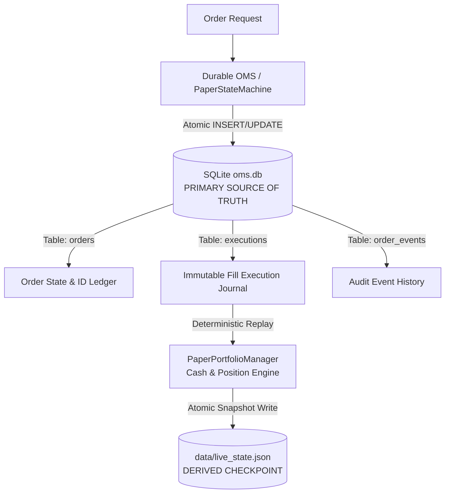

# P2-4: Crash Recovery, Durable Journaling & Deterministic State Replay

## 1. Executive Summary & Objective

The primary objective of **P2-4** is to prove that if the paper-trading service crashes at any point across order creation, fill execution, portfolio mutation, or snapshot persistence, the system can restart cleanly, recover its state deterministically, and prevent both lost economic events and duplicate economic execution.

### Core Recovery Guarantee
$$\text{Recovered State} \equiv \text{DeterministicReplay}(\text{Durable Execution Ledger}) \equiv \text{Expected Pre-Crash State}$$

---

## 2. Existing Persistence Architecture & Source of Truth

The persistence architecture consists of two complementary layers:



### Hierarchy of Authority
1. **Primary Source of Truth**: The SQLite database ([`oms.db`](file:///c:/Users/ajayg/ai_crypto_bot/oms.db)), specifically the immutable `executions` and `orders` tables.
2. **Derived Checkpoint**: [`data/live_state.json`](file:///c:/Users/ajayg/ai_crypto_bot/data/live_state.json), capturing point-in-time portfolio balances for rapid dashboard rendering.
3. **Recovery Policy**: On service restart or crash recovery, the system reads the durable execution ledger (`executions` joined with `orders` ordered by `id ASC`), verifies database integrity (`PRAGMA integrity_check`), and replays every confirmed execution through the portfolio engine.

---

## 3. Durability Classification

| Data Entity | Durability Level | Recovery Mechanism |
| :--- | :--- | :--- |
| **Order Record** | `DURABLE` | Persisted in `orders` table with unique idempotency key. |
| **Execution Fill** | `DURABLE` | Persisted in `executions` table with unique `execution_id`. |
| **Audit Event** | `DURABLE` | Persisted in `order_events` table. |
| **Position Size & Entry** | `RECOVERABLE` | Reconstructed deterministically by replaying `executions`. |
| **Cash & Realized P&L** | `RECOVERABLE` | Recomputed from starting capital less trade costs and fees. |
| **Order VWAP** | `RECOMPUTABLE` | Recomputed dynamically from discrete executions. |
| **Portfolio Equity** | `RECOMPUTABLE` | Mark-to-market mark against live candle prices. |

---

## 4. Crash Windows & Failure Boundaries

Crash injection testing validates 10 critical failure boundaries:

| Crash Point | Failure Window | Expected Recovery Behavior |
| :--- | :--- | :--- |
| **`BEFORE_ORDER_PERSIST`** | Process killed before SQLite insert | Zero phantom orders created; client retry safely re-executes. |
| **`AFTER_ORDER_PERSIST`** | Process killed after order commit | Existing order recovered on restart; retry returns existing order. |
| **`AFTER_STATE_TRANSITION`**| Process killed after state change | State (`SUBMITTED`, `ACKNOWLEDGED`) preserved upon restart. |
| **`BEFORE_EXECUTION_PERSIST`**| Process killed before fill insert | Unpersisted fill not treated as confirmed; state remains intact. |
| **`AFTER_EXECUTION_PERSIST`** | Process killed after fill commit | Fill reloaded from SQLite; applied exactly once. |
| **`BEFORE_PORTFOLIO_UPDATE`** | Process killed before portfolio update | Missing portfolio effect recovered via ledger replay. |
| **`AFTER_PORTFOLIO_UPDATE`** | Process killed after portfolio update | Duplicate execution rejected via `applied_execution_ids`. |
| **`BEFORE_SNAPSHOT`** | Interrupted write to `live_state.json` | Previous valid snapshot survives; partial `.tmp` discarded. |
| **`AFTER_SNAPSHOT`** | Killed after atomic file replacement | New snapshot verified with SHA-256 state checksum. |
| **`DURING_TRANSACTION`** | Process killed mid-transaction | SQLite automatically rolls back uncommitted WAL/journal. |

---

## 5. Atomic Snapshot Persistence

To eliminate corrupted or truncated JSON state files from interrupted writes:
1. Snapshot JSON is written to a unique temporary file: `live_state.json.tmp.<uuid>`.
2. File buffers are explicitly flushed and fsynced (`f.flush()`, `os.fsync()`).
3. Atomic replacement is executed via `os.replace(tmp_path, target_path)`.

```python
with open(tmp_path, "w", encoding="utf-8") as f:
    json.dump(snapshot_data, f, indent=2)
    f.flush()
    os.fsync(f.fileno())
os.replace(tmp_path, file_path)
```

---

## 6. Deterministic & Idempotent Ledger Replay

The recovery engine in [`PaperPortfolioManager.replay_from_oms()`](file:///c:/Users/ajayg/ai_crypto_bot/execution/paper_state_machine.py#L800-L865) reconstructs portfolio state:
1. Validates SQLite database via `PRAGMA integrity_check`.
2. Resets in-memory balances to base initial capital ($100,000.00).
3. Fetches all executions in strict sequence:
   ```sql
   SELECT e.id, e.order_id, e.fill_price, e.fill_qty, e.fee, e.timestamp, e.execution_id,
          o.symbol, o.side
   FROM executions e
   JOIN orders o ON e.order_id = o.id
   ORDER BY e.id ASC
   ```
4. Replays each fill through `apply_order_fill()`.
5. Emits structured recovery summary:
   ```text
   RECOVERY_COMPLETE orders=2 executions=2 duplicates=0 checksum=8a7c2b...
   ```

---

## 7. State Equivalence Verification

State equivalence tests verify that an uninterrupted continuous trading session (**Path A**) produces bitwise and mathematically identical state to an identical sequence subjected to crashes at every boundary (**Path B**):

$$\text{State}_{\text{Path A}} \equiv \text{State}_{\text{Path B}}$$

- **Cash Balance Equality**: Bitwise identical ($100,000 - \sum \text{costs} - \sum \text{fees}$).
- **Position Sizes & Entry Prices**: Exact match across all assets.
- **State Checksum**: SHA-256 fingerprint matches 100%.

---

## 8. Safe Failure & Trading Halt Policy

If SQLite integrity check fails or journal records are corrupted:
1. The engine enters `RECOVERY_FAILED` status.
2. Sets `portfolio.is_trading_halted = True`.
3. Raises [`RecoveryFailureError`](file:///c:/Users/ajayg/ai_crypto_bot/execution/paper_state_machine.py#L75-L78).
4. Refuses to generate or execute new orders until manual inspection.

---

## 9. Scope & Deferred Roadmap Items

The following features remain explicitly deferred to subsequent phases:
- **P2-5**: Market data WebSocket heartbeat & stale quote fallback.
- **P2-6**: Broker API network fault & latency failure injection.
- **P2-7**: Continuous portfolio reconciliation against live exchange balances.
- **P2-8**: 7-day multi-asset continuous soak testing.
