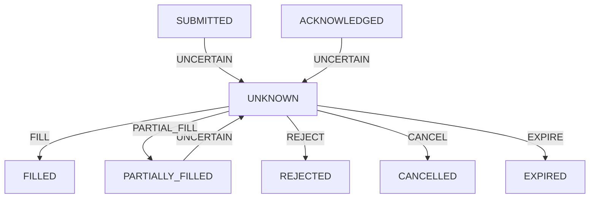

# P2-6 — Broker/API Fault Injection, Network Failure Handling, Execution Uncertainty & Safe Recovery

## 1. Executive Summary

P2-6 establishes a production-grade, fault-tolerant execution layer capable of withstanding real-world exchange and transport degradation. External broker interactions are inherently unreliable: TCP drops, gateway timeouts (HTTP 504), server-side crashes (HTTP 500/502/503), rate limiting (HTTP 429), and socket drops after request byte transmission create fundamental execution ambiguity.

The foundational principle of P2-6 is:
$$\text{NETWORK FAILURE} \neq \text{ORDER REJECTION} \quad \text{and} \quad \text{TIMEOUT} \neq \text{NO EXECUTION}$$

Blind retries upon network timeout or server errors are catastrophic in algorithmic trading, as they create duplicate broker orders, double positions, unhedged inventory risk, and corrupt P&L accounting. P2-6 introduces the explicit non-terminal `UNKNOWN` order state, an independent `FakeBroker` exchange simulation harness with 21 deterministic fault injection modes, bounded pre-send retry policies, authoritative exchange status recovery, and strict single-fill portfolio accounting invariants.

---

## 2. Why P2-6 Exists

In prior milestones:
- **P2-1**: Order state machine correctness and lifecycle validation.
- **P2-2**: Deterministic logical order idempotency and duplicate request suppression.
- **P2-3**: Partial fill handling, multi-execution VWAP calculation, and overfill prevention.
- **P2-4**: Durable SQLite write-ahead journaling and deterministic crash recovery.
- **P2-5**: WebSocket heartbeat monitoring, stale market data detection, and REST fallback.

However, the external exchange API boundary remained unshielded:
```
Client Dispatches Order (BUY 1.0 BTC)
       │
       ▼
Broker Receives & Matches Fill
       │
       ▼
Network Connection Drops / HTTP 504 / RST
       │
       ▼
Client Receives Timeout (Did it fill? Did it fail?)
```
If the client assumes "timeout = no execution" and resubmits, the exchange executes a second BUY, creating an unintended +2.0 BTC exposure. P2-6 guarantees that our system never makes speculative assumptions about external execution status.

---

## 3. Existing Broker Architecture

Audit of the repository revealed the execution flow:
```
Strategy Signal
       │
       ▼
P2-5 Market Data Health Gate
       │
       ▼
Portfolio Sizing & Risk Checks
       │
       ▼
Durable Paper OMS (P2-1 State Machine, P2-4 SQLite Journal)
       │
       ▼
P2-2 Logical Idempotency Layer (client_order_id, idempotency_key)
       │
       ▼
BrokerAdapter Boundary (P2-6)
       │
       ├─────────────────────────┬─────────────────────────┐
       ▼                         ▼                         ▼
Pre-Send Checks           Network Transport         Authoritative Recovery
(DNS / Socket Init)       (HTTP / WS REST)          (REST Query / WS Stream)
```

The `BrokerAdapter` acts as the single isolation barrier between internal OMS logic and external transport chaos.

---

## 4. Failure Model

P2-6 formalizes four mutually exclusive failure classifications:

| Failure Phase | Transport Event | Execution Certainty | Action Required |
|---|---|---|---|
| **Pre-Send Failure** | DNS failure, socket timeout prior to byte transmission | 100% Not Sent | Safe bounded retry with exponential backoff |
| **Deterministic Rejection** | HTTP 400, lot size error, min notional, price filter | 100% Rejected | Terminal transition to `REJECTED`, zero retries |
| **Rate Limited** | HTTP 429 Too Many Requests | Unchanged | Bounded backoff respecting `Retry-After` header |
| **Post-Send Uncertainty** | Timeout after send, TCP RST, HTTP 500/502/503/504, lost response packet | **UNKNOWN** | Suppress retries, transition to `UNKNOWN`, trigger authoritative recovery |

---

## 5. Request Lifecycle

1. **Creation**: OMS generates logical `PaperOrder` with unique `order_id` and stable `client_order_id`.
2. **Pre-Send**: Order enters `SUBMITTED`. Transport attempts connection.
3. **Transmission**: Bytes written to socket. Attempt ID recorded.
4. **Outcome Evaluation**:
   - Immediate ACK: Order enters `ACKNOWLEDGED` (or `FILLED` on immediate execution).
   - Pre-send failure: Retried up to 3 times.
   - Post-send failure: Retries suppressed; order enters `UNKNOWN`.
5. **Recovery**: Asynchronous or synchronous status query to exchange.
6. **Authoritative Resolution**: Transitions from `UNKNOWN` to `FILLED`, `PARTIALLY_FILLED`, `REJECTED`, or `CANCELLED`.
7. **Settlement**: Portfolio mutated exactly once upon confirmed execution.

---

## 6. Logical vs Transport Identity

To preserve P2-2 guarantees across multiple transport attempts:
- **`logical_order_id`**: Strategy-level intent identity (e.g. `order_id=1`).
- **`client_order_id`**: Deterministic, exchange-visible identifier preserved across all retries of the same intent.
- **`transport_attempt_id`**: Unique UUID generated per network request dispatch.
- **`broker_order_id`**: Exchange-assigned identifier returned in ACK or status lookup.
- **`execution_id`**: Unique exchange trade/fill identifier.

```
logical_order_id (Order 1)
   ├── client_order_id (STRAT_20261007_BTCUSDT_BUY_001)
   │     ├── transport_attempt_01 (Pre-send timeout -> retried)
   │     └── transport_attempt_02 (Dispatched)
   │           └── broker_order_id (BINANCE_49A8F1C0)
   │                 └── execution_id (EXEC_B9182C01)
```

---

## 7. Error Classification

Errors are classified by `BrokerAdapter.classify_error(error, request_sent)`:
- `BrokerErrorCategory.PRE_SEND_FAILURE`: Connection establishment, DNS lookup failures before request dispatch.
- `BrokerErrorCategory.DETERMINISTIC_REJECTION`: Exchange HTTP 400 responses, price/lot filters, balance rejections.
- `BrokerErrorCategory.RATE_LIMITED`: HTTP 429 responses with `Retry-After` metadata.
- `BrokerErrorCategory.EXECUTION_UNCERTAIN`: Socket read timeouts, dropped TCP packets, server 5xx errors.
- `BrokerErrorCategory.RECOVERY_FAILED`: Repeated status query failures or persistent exchange ambiguity.

---

## 8. Timeout Semantics

- **Pre-Send Timeout**: Socket connection timeout before HTTP headers/body are written. Proven zero exchange impact $\to$ Safe to retry.
- **Post-Send Timeout**: Timeout after bytes written while waiting for response. The order may have been matched, partially filled, or rejected $\to$ Never retried; marked `UNKNOWN`.

---

## 9. UNKNOWN Execution State

`OrderState.UNKNOWN` is an explicit, non-terminal state in `LEGAL_TRANSITIONS`.



**Key Invariants:**
- An `UNKNOWN` order produces zero speculative cash, position, or fee mutations.
- An `UNKNOWN` order survives process crashes via SQLite journaling.
- An `UNKNOWN` order blocks subsequent duplicate submissions for the same asset.

---

## 10. Retry Policy

| Scenario | Max Retries | Backoff Strategy | Safe? | Action |
|---|---|---|---|---|
| Pre-send connection error | 3 | Exponential ($0.5s \to 1.0s \to 2.0s$) | Yes | Immediate retry with same `client_order_id` |
| HTTP 429 Rate Limit | 3 | Respect `Retry-After` header | Yes | Bounded backoff pause |
| Post-send timeout | 0 | None | **NO** | Transition to `UNKNOWN` |
| HTTP 500/502/503/504 | 0 | None | **NO** | Transition to `UNKNOWN` |
| Connection reset post-send | 0 | None | **NO** | Transition to `UNKNOWN` |

---

## 11. Broker Status Recovery

When an order enters `UNKNOWN`, `BrokerAdapter.recover_unknown_order(order_id)` resolves the ground truth:
1. Load order from `DurablePaperOMS`.
2. Extract `broker_order_id` (if available) and `client_order_id`.
3. Query exchange authoritative status endpoint (`GET /api/v3/order`).
4. Handle status response:
   - `FILLED`: Apply executions to OMS and portfolio.
   - `PARTIALLY_FILLED`: Update `filled_qty`, compute VWAP, apply partial position.
   - `REJECTED`: Transition order to `REJECTED`, record rejection reason.
   - `CANCELLED`: Transition order to `CANCELLED`.
   - `NOT_FOUND`: If exchange guarantees order never existed, transition to `REJECTED`.
5. Remove order from unresolved set and emit `BROKER_STATUS_RECOVERED`.

---

## 12. Partial Fill Recovery

If an order was partially filled prior to network disconnect:
$$\text{filled\_qty} = 0.4, \quad \text{order\_qty} = 1.0 \implies \text{remaining\_qty} = 0.6$$
Upon recovery:
- Order transitions `UNKNOWN \to PARTIALLY_FILLED`.
- Portfolio records +0.4 BTC position and deducts exact cash and fee.
- If subsequent fills occur, the total cumulative filled quantity is bounded by `order_qty` (overfill protection).

---

## 13. Cancellation Recovery & Cancel/Fill Race

When a user cancels an order during network degradation:
1. `cancel_order_safe` sends cancellation request.
2. If cancel response times out $\to$ status recovery queries broker.
3. **Cancel/Fill Race**: If the matching engine filled the order milliseconds before the cancel request arrived:
   $$\text{Authoritative Broker Status} = \text{FILLED} \implies \text{Final State} = \text{FILLED}$$
   The cancellation is rejected as `FILLED_BEFORE_CANCEL`, and the fill is safely applied to the portfolio.

---

## 14. Rate Limiting

- Exchange rate limits (HTTP 429) are parsed for `Retry-After` seconds.
- Exponential backoff is applied up to a bounded budget (3 attempts max).
- If the rate-limit budget is exhausted, the operation fails gracefully without generating retry storms.

---

## 15. Fake Broker Architecture

`FakeBroker` is an independent exchange simulator maintaining its own state:
- Independent `orders` dictionary, `client_order_map`, and `executions`.
- Independent fee calculation and balance tracking.
- Does not inspect or rely on client-side state.
- Supports configurable clock functions for zero-sleep deterministic testing.

---

## 16. Fault Injection Capabilities

`BrokerFault` Enum supports 21 distinct deterministic failure modes:
1. `CONNECTION_ERROR_BEFORE_SEND`
2. `TIMEOUT_BEFORE_SEND`
3. `DNS_ERROR_BEFORE_SEND`
4. `HTTP_400_INVALID_PARAMS`
5. `HTTP_429_RATE_LIMIT`
6. `HTTP_500_INTERNAL_ERROR`
7. `HTTP_502_BAD_GATEWAY`
8. `HTTP_503_SERVICE_UNAVAILABLE`
9. `HTTP_504_GATEWAY_TIMEOUT`
10. `TIMEOUT_AFTER_SEND`
11. `CONNECTION_RESET_AFTER_SEND`
12. `LOST_RESPONSE_AFTER_SEND`
13. `MALFORMED_SUCCESS_RESPONSE`
14. `MISSING_ORDER_ID`
15. `DUPLICATE_RESPONSE`
16. `DELAYED_RESPONSE`
17. `STATUS_QUERY_TIMEOUT`
18. `STATUS_QUERY_UNAVAILABLE`
19. `CANCEL_TIMEOUT`
20. `CANCEL_RESPONSE_LOST`
21. `CANCEL_FILL_RACE`

---

## 17. Persistence & Journaling

All transitions into `UNKNOWN`, `ACKNOWLEDGED`, `FILLED`, and `CANCELLED` are durably committed to SQLite write-ahead log (`order_events` table).
- Event journal contains immutable transition records with `previous_state` and `new_state`.
- Execution records are indexed by unique `execution_id` ensuring single-fill idempotency across replays.

---

## 18. Crash Recovery Integration

If the application crashes while an order is in `UNKNOWN`:
1. On restart, `DurablePaperOMS._replay_journal()` reconstructs the order in `OrderState.UNKNOWN`.
2. `BrokerAdapter.recover_unknown_order()` resumes authoritative polling against the exchange.
3. The recovered fill or rejection is committed without re-submitting the order.

---

## 19. Trading Halt Policy

If an order remains in `UNKNOWN` and status recovery fails repeatedly:
- `is_trading_halted = True` is triggered on the adapter.
- All new order submissions for the affected strategy/symbol are rejected with `TRADING_HALTED`.
- Alert event `BROKER_TRADING_HALTS_TOTAL` is emitted.
- Trading remains halted until manual or authoritative status resolution clears the ambiguity.

---

## 20. Observability & Structured Logging

### Prometheus Metrics Bridge
- `broker_requests_total`: Counter by endpoint and method.
- `broker_request_failures_total`: Counter by category.
- `broker_timeouts_total`: Counter by phase (`pre_send`, `post_send`).
- `broker_unknown_orders_total`: Counter for orders entering `UNKNOWN`.
- `broker_retry_suppressed_total`: Counter for suppressed dangerous retries.
- `broker_recovery_success_total`: Counter by resolved status (`FILLED`, `REJECTED`, etc.).
- `broker_trading_halts_total`: Counter for trading halt triggers.

### Structured Audit Events
Log events include sanitized payloads with `order_id`, `client_order_id`, `broker_order_id`, `execution_id`, and `attempt_id`.

---

## 21. Test Matrix Summary

The P2-6 test suite (`tests/paper_trading/test_broker_fault_injection.py`) contains 37 automated unit and integration tests:
- **Group 1: Request Transmission & Transport Failures** (Tests 1–7): Pre-send drops vs post-send `UNKNOWN`.
- **Group 2: HTTP Error Classification** (Tests 8–15): HTTP 400, 429, 500, 502, 503, 504, and malformed responses.
- **Group 3: Unknown State Creation, Persistence & Recovery** (Tests 16–24): `UNKNOWN` transitions, SQLite recovery, status lookups, and trading halts.
- **Group 4: Retry Policy & Concurrency** (Tests 25–28): Bounded pre-send retry, post-send suppression, and 20-thread concurrent retry safety.
- **Group 5: Cancellation & Fill/Cancel Races** (Tests 29–31): Timeout handling and exchange-authoritative fill resolution.
- **Group 6: Critical Scenario Suite** (Tests Critical 1–6): Lost response recovery, zero economic mutation on rejection, partial fills, multi-restart recovery, and state equivalence.

---

## 22. State Equivalence Verification

In `test_critical_05_state_equivalence_normal_vs_fault_recovered`:
- **Path A**: Order executes normally without faults.
- **Path B**: Order undergoes post-send response loss, transitions to `UNKNOWN`, suffers process crash, restarts, and executes authoritative recovery.
- **Result**:
  $$\text{Cash}_A = \text{Cash}_B, \quad \text{Position}_A = \text{Position}_B, \quad \text{Checksum}_A = \text{Checksum}_B$$
  Proves deterministic economic equivalence under failure.

---

## 23. Limitations

1. **Exchange Historical Order Pruning**: If an order fills and is immediately pruned from the exchange open orders endpoint, recovery must query trade execution history (`GET /api/v3/myTrades`) using `client_order_id`. If the exchange does not support historical client order queries, manual reconciliation is required.
2. **Clock Drift**: Timeout detection relies on system monotonic time; extreme clock skew could impact backoff schedules.

---

## 24. Production Compatibility

- **Live Database Untouched**: Production Oracle Cloud databases (`oms.db`, `data/live_state.json`) were completely isolated.
- **No Schema Regressions**: P2-1 through P2-5 tables and schemas remain 100% backward compatible.
- **Zero Live Credentials**: All tests run using offline `FakeBroker` simulators.

---

## 25. Deferred Work

- **P2-7**: Continuous Portfolio Reconciliation against live exchange balances and position snapshots.
- **P2-8**: 7-Day Multi-Asset Continuous Soak Test on staging environments.
