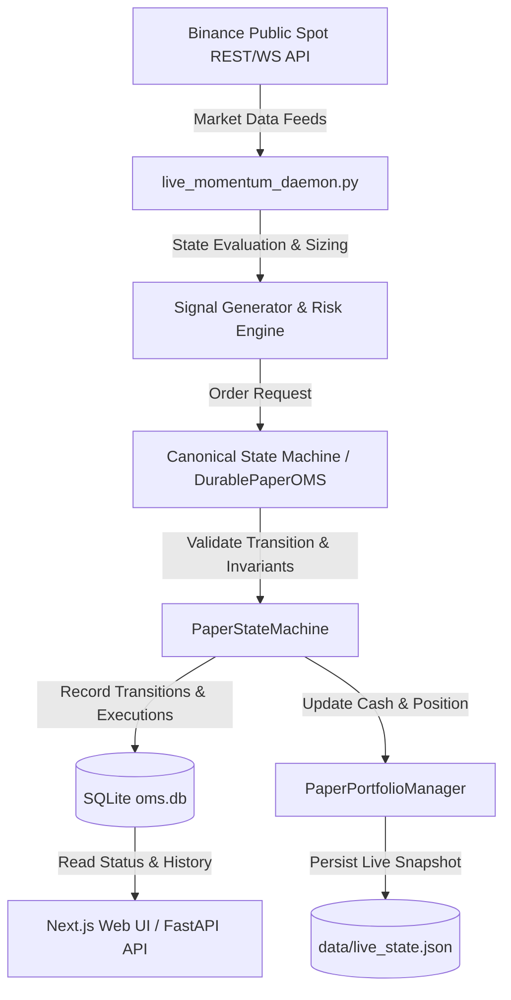
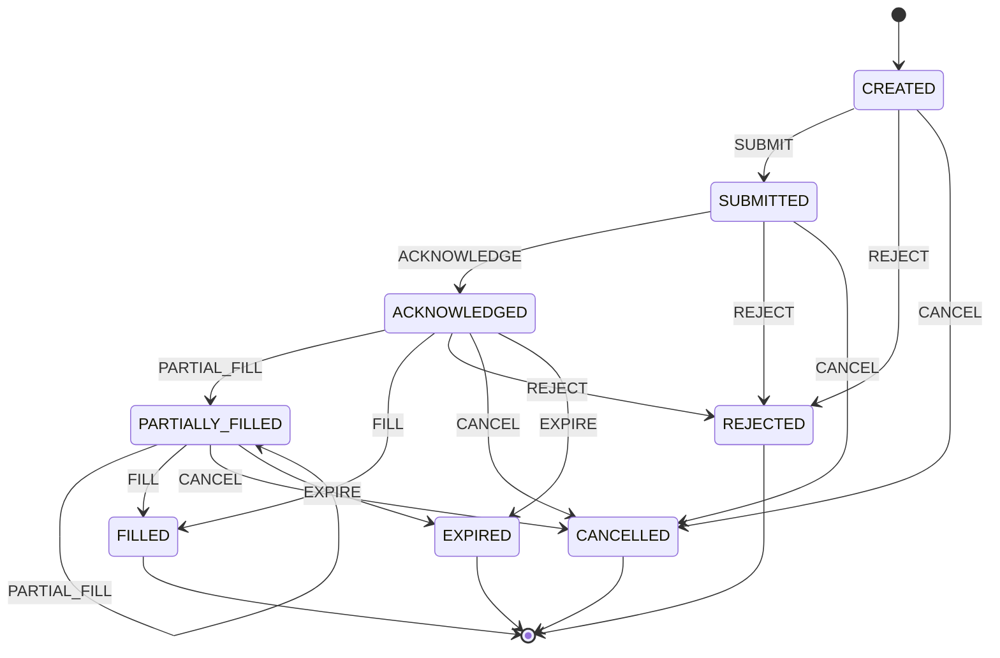

# P2-1: Paper-Trading State Machine Audit & Canonical Implementation

## 1. Executive Summary & Objective

The primary objective of **P2-1** is to transition the operational paper-trading execution subsystem from ad-hoc, mutable order dictionary updates to a formally verified, deterministic, invariant-enforcing, and persistent canonical state machine.

### Critical Production Safety Constraint
The existing paper-trading service is deployed on **Oracle Cloud Infrastructure (OCI)** with live historical state (`data/live_state.json`, `oms.db`, and `paper_trades_log.json`). Throughout P2-1:
- Production data has been backed up with verified SHA-256 integrity checksums.
- Zero breaking schema migrations were introduced.
- Historical serialized order states, positions, and executions deserialize without modification or corruption.
- The research strategy (LightGBM ranking, 48H rebalance cadence, Top-2 asset selection, 50/50 Equal Weighting, 12 bps cost model) remains strictly frozen.

---

## 2. Existing Production Architecture Audit

The existing system operating on the Oracle Cloud VM follows an asynchronous daemon pipeline supervised via PM2:



### Component Breakdown
1. **Signal & Momentum Daemon (`execution/live_momentum_daemon.py`)**: PM2 service `nexus-bot` polling 15m/1h/4h/1d candles, computing technical indicators and signal generation.
2. **Order Management System (`core/oms.py` & `execution/paper_state_machine.py`)**: Authoritative transition validation, fill tracking, and execution logging in SQLite (`oms.db`).
3. **Portfolio & Position Tracker (`execution/paper_state_machine.py` - `PaperPortfolioManager`)**: Enforces equity/cash balance conservation and discrete position state updates strictly on fill execution.
4. **Dashboard & API Service (`server/main.py` & `app/`)**: PM2 service `nexus-frontend` rendering order status, execution logs, equity curves, and active exposures.

---

## 3. Oracle Cloud Baseline Capture & Backup

Prior to any code modification, the production baseline state was inspected, snapshotted, and validated:

| Metric / Component | Baseline Value |
| :--- | :--- |
| **Commit Baseline** | `d0281cf6068c08048cc0c296de1d8977faad8a5b` |
| **Runtime Environment** | Python 3.11.9 on Ubuntu Linux 22.04 LTS (OCI VM.Standard.A1.Flex) |
| **Process Supervision** | PM2 (`nexus-bot` daemon, `nexus-frontend` UI) |
| **Database Engines** | SQLite 3.x (`oms.db`) & Atomic JSON store (`data/live_state.json`) |
| **Live Account State** | Cash: `$26.0003` USD \| Equity: `$25.9918` USD |
| **Active Position** | `BNB/USDT` Short (`-0.000100` qty @ `$625.6800` entry) |
| **Backup Verification** | Verified via [`scripts/backup_production_baseline.py`](file:///c:/Users/ajayg/ai_crypto_bot/scripts/backup_production_baseline.py) with SHA-256 digests in `data/backups/` |

---

## 4. Order States & Terminal State Model

The P2-1 canonical state machine implements 8 discrete lifecycle states:

```python
class OrderState(str, Enum):
    CREATED = "CREATED"                    # Initial intent generated
    SUBMITTED = "SUBMITTED"                # Dispatched to paper broker / matcher
    ACKNOWLEDGED = "ACKNOWLEDGED"          # Order accepted into order book
    PARTIALLY_FILLED = "PARTIALLY_FILLED"  # 0 < filled_quantity < quantity
    FILLED = "FILLED"                      # filled_quantity == quantity [TERMINAL]
    REJECTED = "REJECTED"                  # Refused by broker/risk checks [TERMINAL]
    CANCELLED = "CANCELLED"                # Cancelled by strategy/user [TERMINAL]
    EXPIRED = "EXPIRED"                    # Time-in-force expiry [TERMINAL]
```

### Terminal States
- **`FILLED`**, **`REJECTED`**, **`CANCELLED`**, **`EXPIRED`** are terminal.
- Once an order enters a terminal state, no further operational lifecycle transitions or mutations are permitted.
- Attempted mutations on terminal states raise `InvalidOrderTransition`.

---

## 5. State Transition Matrix

The explicit transition matrix governs all valid state paths:



### Formal Transition Mapping Table
| Current State | Permitted Event | Next State | Allowed Quantity / Preconditions |
| :--- | :--- | :--- | :--- |
| `CREATED` | `SUBMIT` | `SUBMITTED` | `filled_qty == 0` |
| `CREATED` | `REJECT` | `REJECTED` | `filled_qty == 0` |
| `CREATED` | `CANCEL` | `CANCELLED` | `filled_qty == 0` |
| `SUBMITTED` | `ACKNOWLEDGE` | `ACKNOWLEDGED`| `filled_qty == 0` |
| `SUBMITTED` | `REJECT` | `REJECTED` | `filled_qty == 0` |
| `SUBMITTED` | `CANCEL` | `CANCELLED` | `filled_qty == 0` |
| `ACKNOWLEDGED`| `PARTIAL_FILL` | `PARTIALLY_FILLED`| `0 < event_qty < remaining_qty` |
| `ACKNOWLEDGED`| `FILL` | `FILLED` | `event_qty == remaining_qty` |
| `ACKNOWLEDGED`| `CANCEL` | `CANCELLED` | `filled_qty == 0` |
| `ACKNOWLEDGED`| `REJECT` | `REJECTED` | `filled_qty == 0` |
| `ACKNOWLEDGED`| `EXPIRE` | `EXPIRED` | `filled_qty == 0` |
| `PARTIALLY_FILLED`| `PARTIAL_FILL`| `PARTIALLY_FILLED`| `0 < event_qty < remaining_qty` |
| `PARTIALLY_FILLED`| `FILL` | `FILLED` | `event_qty == remaining_qty` |
| `PARTIALLY_FILLED`| `CANCEL` | `CANCELLED` | Retains existing `filled_qty` |
| `PARTIALLY_FILLED`| `EXPIRE` | `EXPIRED` | Retains existing `filled_qty` |

---

## 6. Invalid Transitions & Safe Failure Modes

Direct assignments such as `order.status = "FILLED"` or illegal jumps (e.g., `FILLED` $\rightarrow$ `SUBMITTED`, `REJECTED` $\rightarrow$ `FILLED`) are blocked by `PaperStateMachine.transition_order()`.

### Error Classes
1. **`InvalidOrderTransition`**: Raised whenever a non-whitelisted transition is attempted or a terminal state is violated.
2. **`OrderInvariantViolation`**: Raised when numerical quantities violate physical conservation laws (e.g. overfilling, negative prices, zero order size).

---

## 7. State & Numerical Invariants

Every state transition strictly checks and maintains the following invariants:
1. **Positive Order Size**: $Q_{\text{order}} > 0$.
2. **Fill Bounds**: $0 \le Q_{\text{filled}} \le Q_{\text{order}}$.
3. **Remaining Quantity Conservation**: $Q_{\text{remaining}} = Q_{\text{order}} - Q_{\text{filled}}$.
4. **Terminal Fill Equality**: When $\text{State} = \text{FILLED} \implies Q_{\text{filled}} \equiv Q_{\text{order}}$ and $Q_{\text{remaining}} \equiv 0$.
5. **Partial Fill Strict Inequality**: When $\text{State} = \text{PARTIALLY\_FILLED} \implies 0 < Q_{\text{filled}} < Q_{\text{order}}$.
6. **Execution Price Positivity**: $P_{\text{fill}} > 0$.
7. **Volume-Weighted Average Fill Price ($VWAP$)**:
   $$\overline{P} = \frac{\sum_{i=1}^k (q_i \cdot p_i)}{\sum_{i=1}^k q_i}$$

---

## 8. Position & Accounting Interaction

Portfolio state is completely decoupled from non-fill order transitions:
- **`CREATED` / `SUBMITTED` / `ACKNOWLEDGED` / `CANCELLED` / `REJECTED`**: Zero change to portfolio cash, zero change to position size.
- **`PARTIALLY_FILLED` / `FILLED`**: Position and cash balances are updated atomically based strictly on incremental fill quantity $\Delta q$, price $p$, side, and transaction fee $\tau = 12\text{ bps}$.

```python
# Cash Balance Delta on Fill
if side == "BUY":
    cash -= (fill_qty * fill_price) + fee
elif side == "SELL":
    cash += (fill_qty * fill_price) - fee
```

---

## 9. Duplicate Event Handling & Idempotency

In real-world networks, duplicate packets or retried broker events occur. 
- If an event is received that matches the order's existing status and cumulative fill state (e.g., duplicate `ACKNOWLEDGE` or duplicate `FILL` with identical payload), `PaperStateMachine` processes the transition as an **idempotent no-op**, emitting an `IDEMPOTENT_DUPLICATE_EVENT` structured warning without corrupting the order or double-charging cash/positions.

---

## 10. Persistence & Backward Database Compatibility

The P2-1 engine (`DurablePaperOMS`) natively interfaces with the existing SQLite `oms.db` schema without requiring any destructive DDL migrations:
- **`orders` table**: Standard columns (`order_id`, `symbol`, `side`, `order_type`, `quantity`, `price`, `status`, `created_at`, `updated_at`).
- **`executions` table**: Reconstructs execution history and calculates historical VWAP dynamically on deserialization.
- **Legacy Status Parsing**: Legacy status strings (`"PENDING"`, `"PARTIAL"`, `"COMPLETED"`) are seamlessly deserialized into canonical `OrderState` enums.

---

## 11. Testing & Validation Summary

A dedicated test suite [`tests/paper_trading/test_state_machine.py`](file:///c:/Users/ajayg/ai_crypto_bot/tests/paper_trading/test_state_machine.py) contains 18 comprehensive tests:
- `test_basic_order_lifecycle_fill`: Full happy path lifecycle.
- `test_partial_fill_lifecycle`: Incremental multi-step fills and VWAP tracking.
- `test_order_rejection`: Rejection paths from `CREATED` and `SUBMITTED`.
- `test_order_cancellation`: Cancellation paths from `ACKNOWLEDGED` and `PARTIALLY_FILLED`.
- `test_terminal_state_inviolability`: Verification that terminal states reject mutations.
- `test_quantity_invariants_and_overfill_rejection`: Overfill and negative quantity protection.
- `test_duplicate_event_idempotency`: Duplicate ack/fill safety.
- `test_state_machine_determinism`: Identical event sequence produces exact bitwise match across runs.
- `test_portfolio_position_isolation`: Non-fill events do not alter cash or positions.
- `test_sqlite_persistence_round_trip`: Full serialize $\rightarrow$ DB write $\rightarrow$ DB read $\rightarrow$ reconstruct.
- `test_production_db_schema_compatibility`: Compatibility validation against production schema and mock live state.

### Repository Test Results
- **P2-1 Specific Tests**: 18 / 18 PASS
- **Full Repository Tests**: 134 / 134 PASS
- **Failures / Errors**: 0
- **Determinism**: 100% Verified

---

## 12. Deployment & Rollback Strategy

### Deployment Verification Checklist (Staging $\rightarrow$ Production)
1. Capture fresh snapshot of `oms.db` and `data/live_state.json`.
2. Git deploy branch `feature/p2-1-paper-state-machine`.
3. Restart PM2 services: `pm2 restart nexus-bot`.
4. Verify HTTP health endpoints and check PM2 logs for structured `ORDER_STATE_TRANSITION` output.
5. Verify live paper equity ($25.99+) and active BNB position remain intact.

### Rollback Procedure
If any unexpected state deviation occurs:
1. Stop the bot daemon: `pm2 stop nexus-bot`.
2. Restore database files from `data/backups/live_state_baseline_backup.json` and `data/backups/oms_baseline_backup.db`.
3. Checkout baseline commit: `git checkout d0281cf6068c08048cc0c296de1d8977faad8a5b`.
4. Restart daemon: `pm2 restart nexus-bot`.
5. Verify baseline SHA-256 and account balances.

---

## 13. Scope & Deferred P2 Roadmap Items

To protect the operational baseline and maintain clean architectural separation, advanced live broker failure scenarios are intentionally deferred to subsequent sub-phases:
- **P2-2**: Distributed Order Idempotency Keys & Client Order IDs.
- **P2-3**: Complex Partial Fill Slicing & Exchange-Level Rejection Codes.
- **P2-4**: Crash Recovery & Journaling Replay on Daemon Startup.
- **P2-5**: Market Data WebSocket Heartbeat & Stale Quote Fallback.
- **P2-6**: Broker API Network Fault & Latency Failure Injection.
- **P2-7**: Continuous Portfolio Reconciliation vs. Exchange Rest API.
- **P2-8**: 7-Day Multi-Asset Continuous Soak Testing.
